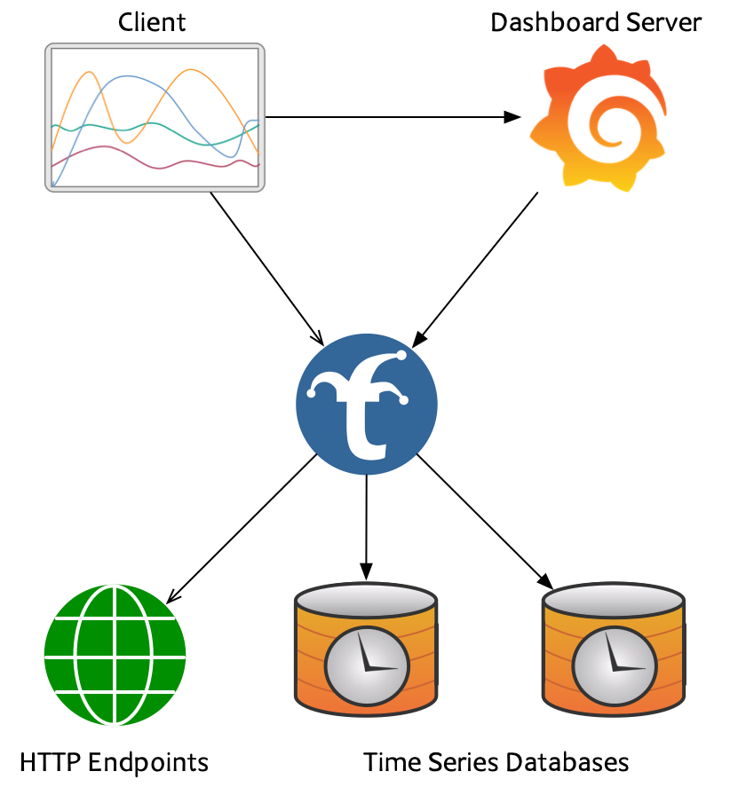
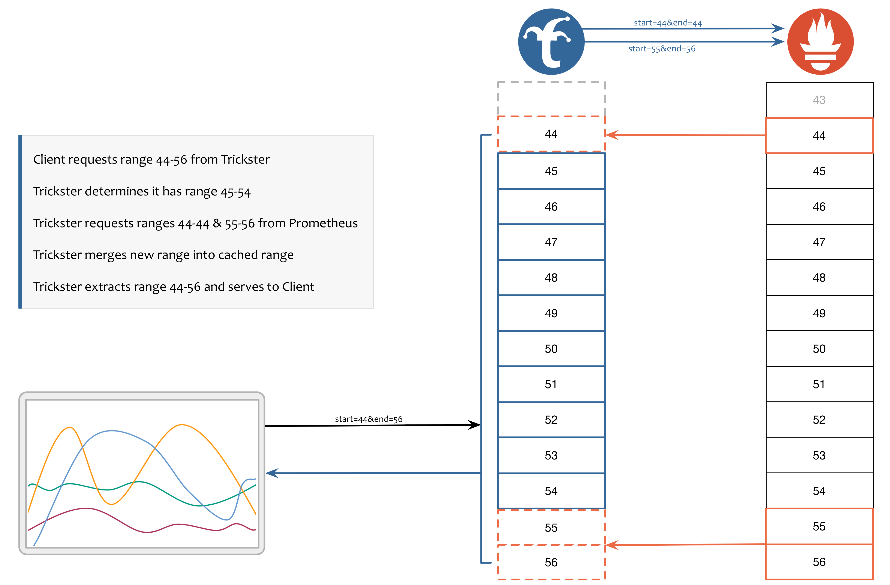
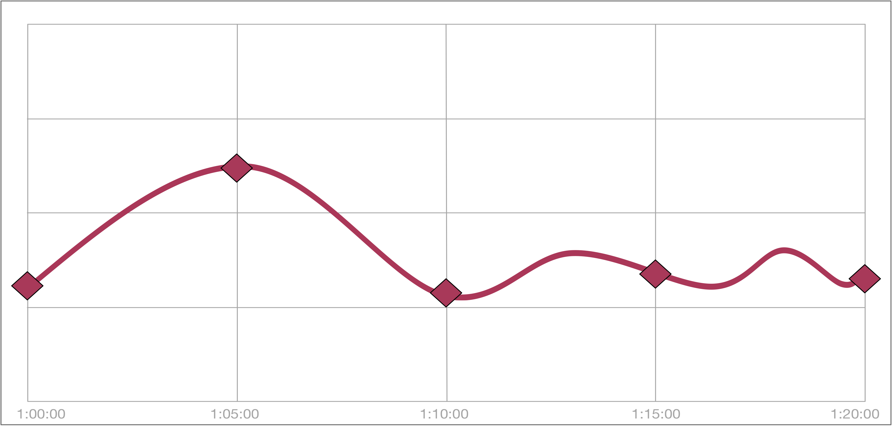
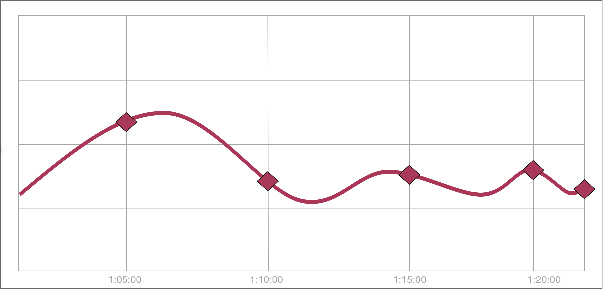

# &nbsp;&nbsp;&nbsp;&nbsp;

Trickster is an HTTP reverse proxy/cache for http applications and a dashboard query accelerator for time series databases.

## HTTP Reverse Proxy Cache

Trickster is a fully-featured HTTP Reverse Proxy Cache for HTTP applications like static file servers and web API's.

### Proxy Feature Highlights

* [Supports TLS](./docs/tls.md) frontend termination and backend origination
* Offers several options for a [caching layer](./docs/caches.md), including in-memory, filesystem, Redis and bbolt
* [Highly customizable](./docs/configuring.md), using simple configuration settings, [down to the HTTP Path](./docs/paths.md)
* Built-in Prometheus [metrics](./docs/metrics.md) and customizable [Health Check](./docs/health.md) Endpoints for end-to-end monitoring
* [Negative Caching](./docs/negative-caching.md) to prevent domino effect outages
* High-performance [Collapsed Forwarding](./docs/collapsed-forwarding.md)
* Best-in-class [Byte Range Request caching and acceleration](./docs/range_request.md).
* [Distributed Tracing](./docs/tracing.md) via OpenTelemetry

## Time Series Database Accelerator

Trickster dramatically improves dashboard chart rendering times for end users by eliminating redundant computations on the TSDBs it fronts. In short, Trickster makes read-heavy Dashboard/TSDB environments, as well as those with highly-cardinalized datasets, significantly more performant and scalable.

### Compatibility

Trickster works with virtually any Dashboard application that makes queries to any of these TSDB's:

 Prometheus

 ClickHouse

 InfluxDB

 Circonus IRONdb

See the [Supported Origin Types](./docs/supported-origin-types.md) document for full details

### How Trickster Accelerates Time Series

#### 1. Time Series Delta Proxy Cache

Most dashboards request from a time series database the entire time range of data they wish to present, every time a user's dashboard loads, as well as on every auto-refresh. Trickster's Delta Proxy inspects the time range of a client query to determine what data points are already cached, and requests from the tsdb only the data points still needed to service the client request. This results in dramatically faster chart load times for everyone, since the tsdb is queried only for tiny incremental changes on each dashboard load, rather than several hundred data points of duplicative data.

#### 2. Step Boundary Normalization

When Trickster requests data from a tsdb, it adjusts the clients's requested time range slightly to ensure that all data points returned are aligned to normalized step boundaries. For example, if the step is 300s, all data points will fall on the clock 0's and 5's. This ensures that the data is highly cacheable, is conveyed visually to users in a more familiar way, and that all dashboard users see identical data on their screens.

#### 3. Fast Forward

Trickster's Fast Forward feature ensures that even with step boundary normalization, real-time graphs still always show the most recent data, regardless of how far away the next step boundary is. For example, if your chart step is 300s, and the time is currently 1:21p, you would normally be waiting another four minutes for a new data point at 1:25p. Trickster will break the step interval for the most recent data point and always include it in the response to clients requesting real-time data.

## Install

### Docker

Docker images are available on Docker Hub:

    $ docker run --name trickster -d -v /path/to/trickster.conf:/etc/trickster/trickster.conf -p 0.0.0.0:9090:9090 tricksterio/trickster

See the 'deploy' Directory for more information about using or creating Trickster docker images.

### Kubernetes and Helm

See the 'deploy' Directory for both Kube and Helm deployment files and examples.

### Building from source

To build Trickster from the source code yourself you need to have a working
Go environment with [version 1.9 or greater installed](http://golang.org/doc/install).

You can directly use the `go` tool to download and install the `trickster`
binary into your `GOPATH`:

    $ go get github.com/Comcast/trickster
    $ trickster -origin http://prometheus.example.com:9090

You can also clone the repository yourself and build using `make`:

    $ mkdir -p $GOPATH/src/github.com/Comcast
    $ cd $GOPATH/src/github.com/Comcast
    $ git clone https://github.com/Comcast/trickster.git
    $ cd trickster
    $ make build
    $ ./trickster -origin http://prometheus.example.com:9090

The Makefile provides several targets, including:

* *build*: build the `trickster` binary
* *docker*: build a docker container for the current `HEAD`
* *clean*: delete previously-built binaries and object files
* *test*: runs unit tests

## More information

* Refer to the [docs](./docs/) directory for additional info.

## Contributing

Refer to [CONTRIBUTING.md](CONTRIBUTING.md)

## Who Is Using Trickster

As the Trickster community grows, we'd like to keep track of who is using it in their stack. We invite you to submit a PR with your company name and @githubhandle to be included on the list.

1. [Comcast](https://comcast.github.io) [[@jranson](https://github.com/jranson)]
2. [Selfnet e.V.](https://www.selfnet.de/) [[@ThoreKr](https://github.com/ThoreKr)]
3. [swarmstack](https://github.com/swarmstack) [[@mh720](https://github.com/mh720)]
4. [Hostinger](https://www.hostinger.com/) [[@ton31337](https://github.com/ton31337)]
