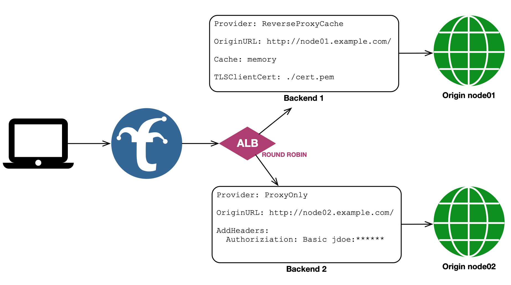
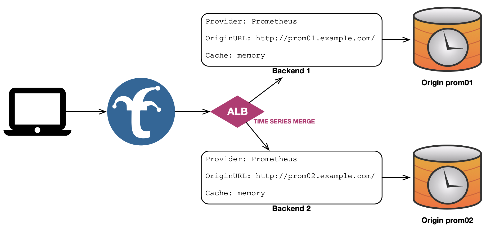
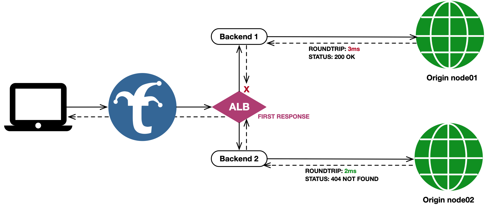
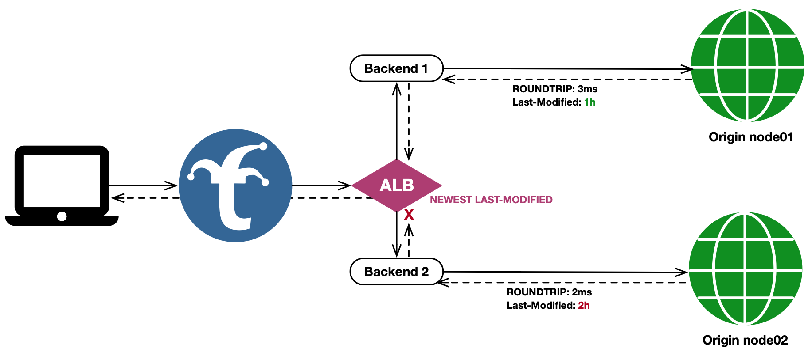
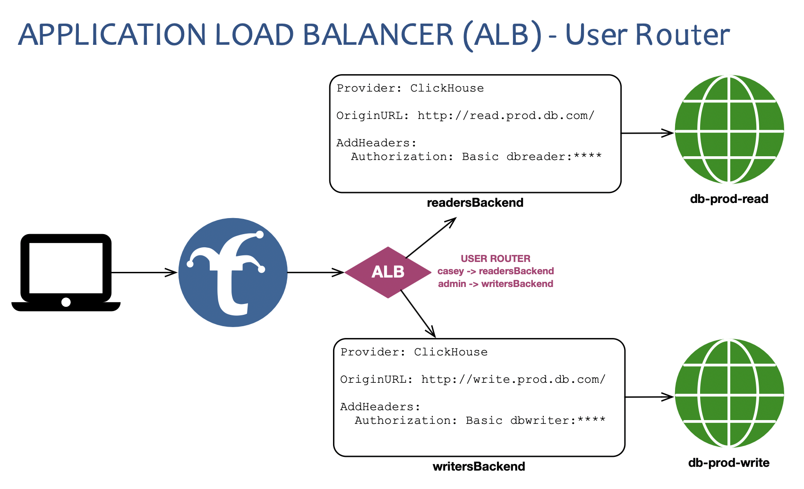

# Application Load Balancer

Trickster 2.x provides an Application Load Balancer that is easy to configure and provides unique features to aid with Scaling, High Availability and other applications. The ALB supports several balancing Mechanisms:

| Mechanism | Config | Provides | Description |
|-----|-----|-----|----|
| Round Robin | rr | Scaling | a basic, stateless round robin between healthy pool members |
| Power of Two Choices | p2c | Scaling | draws two healthy pool members at random and routes to the one with fewer requests in flight |
| Least Connections | lc | Scaling | routes to the healthy pool member with the fewest requests in flight |
| Least Time | lt | Speed | routes to the healthy pool member with the lowest response latency, scaled by its requests in flight |
| Highest Random Weight | hrw | Affinity | consistently routes each client, tenant or other key to the same healthy pool member |
| Time Series Merge | tsm | Federation | uses scatter/gather to collect and merge data from multiple replica tsdb sources |
| First Response | fr | Speed | fans a request out to multiple backends, and returns the first response received |
| First Good Response | fgr | Speed | fans a request out to multiple backends, and returns the first response received with a status code < 400 |
| Newest&nbsp;Last‑Modified | nlm | Freshness | fans a request out to multiple backends, and returns the response with the newest Last-Modified header |
| User Router | ur | Control | Inspects the credentials in the Request and routes it based on the Username |
| Connect Race | race | Speed | connects a `tcp` or `tls` stream connection to several pool members at once and relays over the first to connect |
| UDP Mirror | mirror | Replication | copies every datagram of a `udp` stream session to every healthy pool member, and answers from the first |

## Integration with Backends

The ALB works by applying a Mechanism to select one or more Backends from a list of Healthy Pool Members, through which to route a request. Pool member names represent Backend Configs (known in Trickster 0.x and 1.x as Origin Configs) that can be pre-existing or newly defined.

All settings and functions configured for a Backend are applicable to traffic routed via an ALB - caching, rewriters, rules, tracing, TLS, etc.

In Trickster configuration files, each ALB itself is a Backend, just like the pool members to which it routes. This makes it possible to configure infinite loops (e.g., where ALB1 has ALB2 in its pool, and ALB2 has ALB1 in its pool). However, at startup Trickster will validate ALB configurations by following all ALBs' possible paths, and exit with a startup failure if any infinite loops are detected.

In addition to (or instead of) a static pool list, an ALB's pool membership can be discovered and kept current automatically at runtime — from Kubernetes, the AWS, Google Cloud and Azure APIs, the Docker Engine, the Consul or Nomad service registries, DNS records, an HTTP endpoint, or a watched member-list file. See [ALB Autodiscovery](./alb-autodiscovery.md).

## Mechanisms Deep Dive

Each mechanism has its own use cases and pitfalls. Be sure to read about each one to understand how they might apply to your situation.

### Basic Round Robin

A basic **Round Robin** rotates through a pool of healthy backends used to service client requests. Each time a client request is made to Trickster, the round robiner will identify the next healthy backend in the rotation schedule and route the request to it.

To keep each client on the member it was first sent to, add [Sticky Sessions](#sticky-sessions) to the ALB. For affinity without session state, see [Highest Random Weight](#highest-random-weight).

#### Weighted Round Robin

Trickster supports Weighted Round Robin with a first-class integer `weight` on pool entries. A pool entry may be a plain backend name (weight 1) or a mapping with an explicit weight:

```yaml
pool:
  - node01            # weight 1
  - name: node02
    weight: 3         # receives 3 of every 4 requests
```

Apportionment is exact: over any `totalWeight` consecutive requests against a stable healthy pool, each member is selected exactly `weight` times. A heavier member's turns are spread through the rotation rather than taken back to back: two members weighted 3 and 2 are served `A B A A B`, not `A A A B B`. Weights also carry through from autodiscovery sources that convey them (DNS SRV record weights, member-file `weight` fields); see [ALB Autodiscovery](./alb-autodiscovery.md).

Weights apply to every mechanism that selects a single member per request, though only Round Robin makes them an exact guarantee; see [Weights and the Selection Mechanisms](#weights-and-the-selection-mechanisms). Fan-out mechanisms (fr, fgr, nlm, tsm) dispatch to every healthy member regardless of weight.

#### More About Our Round Robin Mechanism

Trickster's Round Robin Mechanism works by maintaining an atomic uint64 counter that increments each time a request is received by the ALB. With uniform weights, the ALB performs a modulo operation on the request's counter value, with the denominator being the count of healthy backends in the pool; the resulting value, ranging from `0` to `len(healthy_pool) - 1`, indicates the assigned backend based on the counter and current pool size. With mixed weights, the modulo denominator becomes the pool's total weight, and the result indexes a rotation schedule, computed once each time the set of healthy members changes, in which every member's turns are evenly spaced. Selection remains lock- and allocation-free in both forms. The counter starts at a random value, so a fleet of Trickster replicas started together does not send its first requests to the same pool member.

#### Example Round Robin Configuration

```yaml
backends:

  # traditional Trickster backend configurations

  node01:
    provider: reverseproxycache # will cache responses to the default memory cache
    path_routing_disabled: true # disables frontend request routing via /node01 path
    origin_url: https://node01.example.com # make requests with TLS
    tls: # this backend might use mutual TLS Auth
      client_cert_path: ./cert.pem
      client_key_path: ./cert.key

  node02:
    provider: reverseproxy      # requests will be proxy-only with no caching
    path_routing_disabled: true # disables frontend request routing via /node02 path
    origin_url: http://node-02.example.com # make unsecured requests
    request_headers: # this backend might use basic auth headers
      Authoriziation: "basic jdoe:${NODE_02_AUTH_TOKEN}"

  # Trickster 2.x ALB backend configuration, using above backends as pool members

  node-alb:
    provider: alb
    alb:
      mechanism: rr # round robin
      pool:
        - node01 # as named above; weight 1
        - node02
        # to weight the pool, use the mapping form on any entry:
        # - name: node02
        #   weight: 2 # node02 would receive 2 of every 3 requests
```

Here is the visual representation of this configuration:



### Power of Two Choices

The **Power of Two Choices** (p2c) mechanism draws two healthy pool members at random and routes the request to whichever has fewer requests in flight. It keeps load nearly as even as inspecting every member would, at a cost that does not grow with the size of the pool, and unlike Round Robin it reacts to a member that has become slow: requests pile up there, so it loses more of its draws. It is a good default for large pools and for requests whose cost varies widely.

```yaml
backends:
  api:
    provider: alb
    alb:
      mechanism: p2c # or power_of_two_choices
      pool: [ node01, node02, node03 ]
```

### Least Connections

The **Least Connections** (lc) mechanism routes each request to the healthy pool member with the fewest requests in flight. It reads every member on every request, so it suits small pools; Power of Two Choices approximates it for large ones. While several members are tied, as all are when the pool is idle, they take turns.

```yaml
backends:
  api:
    provider: alb
    alb:
      mechanism: lc # or least_connections
      pool: [ node01, node02 ]
```

### Least Time

The **Least Time** (lt) mechanism routes each request to the healthy pool member that has been answering fastest. Each member's score is its latency average multiplied by one more than its requests in flight, and the lowest score wins, so a fast member is preferred until it is busy enough that a slower one would answer sooner.

Latency is the time from routing a request to the first byte of its response. The average rises at once when a member slows down and falls gradually, over `lt.decay`, as it recovers. A few details keep the ranking honest:

* A member with no requests yet, such as one just discovered, is scored as its fastest peer. It shares that peer's requests until its own first response ranks it, so it is neither flooded as the apparent fastest nor left waiting for a turn that an idle pool would never give it.
* A failed request is recorded as a long latency rather than a short one, so a member that returns errors in a millisecond never looks fast. By default a response of `502`, `503` or `504` is a failure, as is one that was never completed; `lt.status_codes` sets the codes that count as a good answer instead, as bare codes, inclusive ranges, or both. A request the client abandoned counts neither way.
* A member's average fades while it is passed over, so one ranked last on an old measurement or a past failure is tried again rather than ignored for good.
* Averages survive a configuration reload and autodiscovery membership changes.

When the pool is idle and its members are equally loaded, every request goes to the fastest member. That is the mechanism working as intended; choose `p2c` or `lc` to spread idle traffic instead.

```yaml
backends:
  video:
    provider: alb
    alb:
      mechanism: lt # or least_time
      pool: [ edge01, edge02 ]
      lt:
        decay: 10s # default
        status_codes: [ { start: 200, end: 499 } ] # optional; default is every code but 502, 503 and 504
```

### Highest Random Weight

The **Highest Random Weight** (hrw) mechanism, also known as rendezvous hashing, routes every request that shares a key to the same healthy pool member. Use it to keep a client or tenant on one member's warm cache. When a member leaves the pool, only the keys it owned move, each to a different remaining member; when it returns, exactly those keys move back. The mapping depends only on the key and the members' names, so every Trickster replica agrees on it and a restart does not change it.

`hrw.key` selects what is hashed:

| Key | Follows |
|-----|-----|
| `client_ip` (default) | the client's IP address, after [trusted proxy](./configuring.md) resolution. The port is never part of the key. IPv6 addresses are keyed on their leading `hrw.ipv6_prefix` bits (default `64`), because privacy addressing changes the rest of a client's address over time. |
| `host` | the request's host name, without its port and without regard to case |
| `header:<name>` | the first value of the named request header |
| `cookie:<name>` | the value of the named cookie |
| `query:<name>` | the value of the named query string parameter, as written in the URL |
| `sni` | the TLS server name the client offered; only for an ALB that serves a `tls` [stream listener](#load-balancing-stream-listeners) |
| `proxy_tlv:<type>` | the value of a [PROXY protocol](./configuring.md) version 2 TLV, such as `proxy_tlv:0xEA` for an AWS VPC endpoint ID; only for an ALB that serves a `tcp` or `tls` stream listener with `proxy_protocol` enabled. The type is one byte, written in decimal or `0x` hex. |
| `user` | the user name a session authenticated as; only for an ALB that serves a [native protocol listener](#load-balancing-native-protocol-sessions) |

A request that lacks the configured key, such as one without the header, has no affinity to preserve and is routed to a member at random.

hrw balances keys, not requests. With many keys of similar volume the members' loads even out, but a single very busy key is always served by one member.

hrw keeps no state, so a key moves when a member joins the pool and wins it, and a client with no stable key has no affinity at all. To keep a client on its member for as long as its session lasts, whatever the pool does, add [Sticky Sessions](#sticky-sessions), which work with hrw as with every mechanism that selects one member.

```yaml
backends:
  tenants:
    provider: alb
    alb:
      mechanism: hrw # or highest_random_weight
      pool: [ cache01, cache02, cache03 ]
      hrw:
        key: header:X-Tenant
```

### Sticky Sessions

An ALB whose mechanism selects one member per request, `rr`, `p2c`, `lc`, `lt` or `hrw`, can keep each client on the member it was first sent to. The mechanism chooses a new client's member; after that, the client's requests go to the same member for as long as its session lasts and that member is available, even as members join or leave the pool. The same holds for the connections of a [stream listener](#load-balancing-stream-listeners) and the sessions of a [native protocol listener](#load-balancing-native-protocol-sessions); see [Stream and native listeners](#stream-and-native-listeners).

```yaml
backends:
  app:
    provider: alb
    alb:
      mechanism: p2c
      pool: [ app1, app2, app3 ]
      sticky:
        ttl: 8h
        secret_file: /etc/trickster/sticky.key
```

A session is kept in one of three ways, set by `sticky.mode`:

| Mode | How the member is remembered | Suits |
|-----|-----|-----|
| `cookie` (the default on http listeners) | The ALB issues a signed token naming the member in a cookie, which the browser sends back. The ALB keeps no state. | browsers |
| `header` | The same token in a response header, `X-Trickster-Session` by default, which the client sends back in a request header of the same name. | API clients and SDKs that do not keep cookies |
| `table` (the default on stream and native listeners) | The ALB remembers each client's member by a key read from its requests, connections or sessions, such as its address or a header. | clients with a stable identifier of their own, upstreams that hand out their own session ids, and every listener that is not http |

The settings, with their defaults:

```yaml
      sticky:
        mode: ""                 # cookie, header or table; unset is cookie on http listeners, table on the others
        ttl: 1h                  # a session's lifetime from its first request; 0 is no limit
        idle: 0                  # ends a session unused this long; 0 never does
        on_unavailable: repick   # repick or reject; see below
        secret: ""               # the key tokens are signed with; see below
        secret_file: ""          # a file holding it, in place of secret
        cookie:                  # cookie mode only
          name: trickster_sticky
          path: /
          domain: ""             # unset keeps the cookie to the host that set it
          secure: auto           # auto marks it Secure when the request arrived over TLS; or true, false
          http_only: true
          same_site: lax         # lax, strict or none, which requires secure: true
          lifetime: permanent    # or session, which never sets Max-Age; see below
          mark_private: false
        header:                  # header mode only
          name: X-Trickster-Session
        table:                   # table mode only
          key: client_ip
          learn: request         # or response; see below
          ipv6_prefix: 64
          max_entries: 100000
```

`ttl` and `idle` are 0 or at least 1s. Configure only the block for the mode in use: a `cookie`, `header` or `table` block that the mode never reads is a configuration error.

#### Tokens

In `cookie` and `header` mode the token carries the member, when the session began and when the token was issued, signed with HMAC-SHA256 under a key derived from `sticky.secret`. A token is bound to the ALB that issued it, so another ALB does not honor it. A client cannot choose its own member, and a token that is altered, signed with another key, issued by another ALB or past its lifetime is treated as no token: the request starts a new session. It is never an error.

A token is issued with the response to a client's first request, including the `101 Switching Protocols` that opens a WebSocket, when its session moves to another member, and, with `idle` set, once more than half of `idle` has passed since the token was issued, so that an active session does not lapse. A request sent to the member its token names is otherwise answered with no token, so a steady client sees none after its first.

A cookie carries a `Max-Age` that ends with its token when `ttl` is set. With `ttl: 0`, or with `lifetime: session`, it is a browser-session cookie, and the token itself still enforces `ttl` and `idle`. Set `mark_private: true` to add `Cache-Control: private` to a response that sets the cookie. A shared cache should not store a response that sets a cookie, so in front of cacheable content prefer `header` or `table` mode, which leave responses as the members wrote them. The ALB adds the token outside any member's cache, so it is never part of a cached object.

Two ALBs that set the same cookie (by name, domain and path) for a host they both serve would each replace the other's token in a browser, so Trickster refuses to start with such a configuration. A browser sends a host's cookies to every port and scheme, so this holds across listeners. To resolve it, give one of them its own `cookie.name`.

ALBs whose served hosts do not overlap may share a cookie name, as long as the cookie sets no `domain`. A cookie with no domain goes back only to the host that set it. The hosts an ALB serves are:

- every host, when it is the default backend, or when one of its paths registers on a listener and it has `any_host_routing` or path routing on (the default). Path routing answers `/<alb name>/...` on every host, whatever `hosts` lists. A path registers on a listener unless it is marked `dispatch_only` or names a handler the ALB lacks. The ALB's default paths count, unless `path_defaults_disabled` is set;
- otherwise, the `hosts` its listener-registered paths answer for, joined by the hosts of its dispatchers, since a dispatched request keeps the host it arrived on. Its dispatchers are the ALBs that name it in their pool or `user_router`, and the rules that route to it. An ALB with no `hosts`, `path_routing_disabled: true`, or only `dispatch_only` paths serves only its dispatchers' hosts;
- no host, when nothing but a mirror reaches it. A mirror discards its target's response, so no cookie from it reaches a browser, and such an ALB never conflicts.

#### The secret

Every Trickster replica behind one address, and every restart, must sign with the same key for a session to survive moving between them. Set `secret` to at least 32 bytes, or `secret_file` to a file that holds them, such as a mounted Kubernetes Secret; trailing line breaks in the file are ignored. Tokens made with one key are never honored with another. A `secret` that still contains `${`, an environment variable reference that was not expanded, is refused rather than used as a publicly known key.

With neither set, the ALB signs with a random key that lasts as long as the process, and Trickster logs a warning at startup. That suits a single instance that can afford to start every session over when it restarts.

#### When the pinned member is unavailable

With `on_unavailable: repick`, the default, a request whose member is unavailable goes to the member the mechanism chooses, and its session moves there. With `reject`, the ALB answers `503 Service Unavailable` instead, for applications that cannot survive a move, and the client keeps its token so that it returns to its member once that member is available again. A member that has left the pool has no session to return to, so its clients start new sessions in either case.

A member that is [draining](#draining-pool-members) keeps its sessions while it is available.

#### Table mode

In `table` mode the ALB keeps a table of each client's member, by `table.key`, which takes the same values as [`hrw.key`](#highest-random-weight). A request without the key is balanced by the mechanism and not remembered. An entry lasts `ttl` from when it was stored and ends early when unused for `idle`. A full table drops the least recently used of a sample of its entries to make room.

With `table.learn: response` and a `header:<name>` or `cookie:<name>` key, the ALB also remembers the value a member hands the client in its response, in the header of that name or in the `Set-Cookie` that sets that cookie. That keeps a session on the member that created it from the client's very next request, which is what an upstream that issues its own session ids needs. For example, for an MCP server whose replicas each know only the sessions they created:

```yaml
      sticky:
        mode: table
        table:
          key: header:Mcp-Session-Id
          learn: response
```

A response that sets a new value for a client moves its entry to the new value.

A table is kept in each Trickster instance's memory. It survives a configuration reload that leaves the ALB's `mode`, `ttl`, `idle` and `table` settings unchanged, but not a restart, and it is not shared between replicas: use `cookie` or `header` mode where sessions must outlive either. With `key: client_ip`, every client behind one NAT address shares a session.

#### Stream and native listeners

A `tcp`, `tls` or `udp` listener, or a native protocol listener such as `mysql`, carries no token, so an ALB keeps the sessions of its connections there in a table. `mode` is best left unset: an ALB that serves both http and stream listeners then issues cookies to its requests and keeps its connections in a table. `cookie` and `header` mode are refused on a listener that is not http. With `mode: table`, requests and connections share one table, so a client whose requests and connections share a key keeps one member for both.

`table.key` is read from each connection or session, as `hrw.key` is:

| Listener | `table.key` |
|-----|-----|
| `tcp` | `client_ip`; `proxy_tlv:<type>` with `proxy_protocol` |
| `tls` | `client_ip`, `sni`; `proxy_tlv:<type>` with `proxy_protocol` |
| `udp` | `client_ip` |
| native (`mysql`) | `client_ip`, `user` |

`client_ip` is the address a [PROXY protocol](./configuring.md) header names when the listener trusts one. `user` is the name a native session authenticated as. A connection or session without its key is balanced by the mechanism and not remembered.

A connection is pinned to its member once it reaches it: a `tcp` or `tls` connection when it connects, a `udp` session when its member first answers, or when a one-way member's session ends with no port-unreachable, and a native session when it is handed to its member. A member that cannot be reached is never pinned. A `udp` session already stays with its member for its whole life; what a pin adds is that the client's next session, from any port, lands on the same member.

With `on_unavailable: reject`, a connection whose pinned member is unavailable is refused, and so is one whose pinned member cannot be connected, however many `connect_retries` the ALB has: the retries would move the session. With `repick`, a failed connect is offered to other members as `connect_retries` allows, and its session moves to the one that connects. A native session that is refused fails to route, as it would with no member available.

#### Sticky Sessions and Nested ALBs

When a sticky ALB's pool has ALBs in it, such as one per region or per service, its token or table entry keeps the whole path: the inner ALB the client was sent to and that ALB's member. The inner ALBs need no `sticky` block of their own. When only the inner member becomes unavailable, the session stays with its inner ALB and moves within it. When the inner ALB has no member left, the session moves to another inner ALB with `on_unavailable: repick`, and is refused with `reject`. On a stream listener, a connection retried after its inner member failed to connect is likewise offered the inner ALB's other members first. The session covers one level of nesting: an ALB further in selects its member, or keeps sessions of its own if it has a `sticky` block, as it would with no outer session. An inner ALB directly in the sticky ALB's pool follows the outer session, and uses a `sticky` block of its own only for requests that reach it without going through the outer ALB.

On a stream listener only the ALB that the listener maps to keeps sessions: an inner ALB's own `sticky` block applies to its http listeners, and to stream listeners mapped to it directly, never to connections that reach it through another ALB.

#### Sticky Session Metrics

`trickster_alb_sticky_total{alb_name, result}` counts requests, connections and native sessions by how their session fared: `hit` (sent to its member), `miss` (no token or table entry), `expired`, `invalid`, `repick` (its member was unavailable and it moved) and `rejected`. In table mode an expired entry counts as a `miss`. A connection is counted once it reaches its member, or once it is refused; one that reaches no member is not counted. `trickster_alb_sticky_entries{alb_name}` is the number of entries in an ALB's table.

### WebSockets and Other Protocol Upgrades

A request that asks to switch protocols, such as a WebSocket handshake, is tunneled by the pool member it is sent to when the ALB's mechanism sends each request to one member (`rr`, `p2c`, `lc`, `lt`, `hrw`) or is the [User Router](#user-router). The mechanisms that fan a request out (`fr`, `fgr`, `nlm`, `tsm`) have no one member to tunnel to, so they ignore the upgrade and serve the request as an ordinary one, as HTTP permits.

### Load Balancing Stream Listeners

The mechanisms that select one member, `rr`, `p2c`, `lc`, `lt` and `hrw`, also balance the connections of a `tcp` or `tls` [stream listener](./configuring.md) and the sessions of a `udp` one. They are the same mechanisms with the same weights; only what they measure differs. The mechanisms that fan a request out (`fr`, `fgr`, `nlm`, `tsm`) and the User Router need an HTTP request, and are refused on a stream listener. Two more mechanisms, [`race` and `mirror`](#connect-race-and-udp-mirror), serve only stream listeners.

| | http | tcp and tls | udp |
|-----|-----|-----|-----|
| unit of work | a request | a connection | a session: one client address and port |
| in flight (`p2c`, `lc`, `lt`) | requests being served | connections open | sessions open |
| latency (`lt.signal`) | `first_write`: the first byte sent to the client | `connect` (default): the time to connect to the member; or `first_byte`: the member's first byte | `first_reply`: the member's first datagram |
| `hrw.key` | `client_ip`, `host`, `header:`, `cookie:`, `query:` | `client_ip`; `sni` on a `tls` listener; `proxy_tlv:<type>` with `proxy_protocol` | `client_ip` |

A connection or session stays on the member it was given until it ends, whatever the mechanism. `client_ip` is the address a [PROXY protocol](./configuring.md) header names when the listener trusts one. To keep a client's later connections on one member too, give the ALB a [`sticky`](#stream-and-native-listeners) block.

Two settings apply only to an ALB that selects one member on a stream listener, under `alb.stream`:

```yaml
backends:
  pg:
    provider: alb
    listener_names: [ postgres ]
    alb:
      mechanism: p2c
      pool: [ pg1, pg2, pg3 ]
      stream:
        connect_retries: 1       # default 0
        passive_health:          # off unless present
          failures: 3            # default
          eject: 30s             # default
          max_ejected_percent: 50 # default
```

* `connect_retries` is how many other members a `tcp` or `tls` connection is offered when it cannot connect to the one it was given. All attempts share the listener's `stream.connect_timeout`. The default, 0, refuses the connection, which is what keeps a weighted split exact: a member under the reserved `.invalid` domain exists to refuse its share, and is never retried past. `udp` has no connect to fail, so it is not retried.
* `passive_health` takes a member out of the pool after `failures` consecutive failed connects, for `eject`, without waiting for a health check. Only failures to reach the member count, never anything it sent. At most `max_ejected_percent` of the pool is out at once, and the last live member is never ejected. When `eject` ends the member returns, unless its health check has it down. On `udp`, where nothing connects, a member that answers a datagram with a port-unreachable is what counts as a failure.

Health checks work as they do for HTTP pools: a `tcp://` member with a `healthcheck.interval` is probed by opening a connection to it. A `udp://` member has no generic probe; rely on [autodiscovery](./alb-autodiscovery.md) readiness or on `passive_health`.

#### Connect Race and UDP Mirror

Two mechanisms exist only for stream listeners, because they commit one flow to several members at once. Both use every healthy member that has an address to dial, ignore `weight`, and take neither `connect_retries` nor `passive_health`. An ALB that uses one must be mapped to the stream listener directly; it cannot be a member of another ALB's pool.

The **Connect Race** (`race`, or `connect_race`) mechanism serves `tcp` and `tls` listeners. Each client connection is connected to several members at once, within the listener's `stream.connect_timeout`; the first member to connect carries the connection, and the other attempts are closed. A member that is down or slow to accept costs the client nothing. `stream.race_width` is how many members are raced, from 2 to 8; the default is every member, up to 4. In a pool wider than the race, each connection starts one member further along, so the connects are shared across the pool. A race opens and discards connections on the members that lose, so use it where a connect is cheap for the member.

The **UDP Mirror** (`mirror`, or `udp_mirror`) mechanism serves `udp` listeners. Every datagram a client sends is copied to every healthy member, which suits one-way protocols such as statsd, syslog and NetFlow. The first healthy member in pool order answers the session: only its replies are relayed to the client, and the other members' replies are discarded. A mirror pool has at most 8 members.

```yaml
backends:
  statsd:
    provider: alb
    listener_names: [ statsd ]
    alb:
      mechanism: mirror
      pool: [ statsd1, statsd2 ]
  db:
    provider: alb
    listener_names: [ postgres ]
    alb:
      mechanism: race
      pool: [ pg1, pg2, pg3 ]
      stream:
        race_width: 2
```

### Load Balancing Native Protocol Sessions

A listener that speaks a backend's own wire protocol, such as a `mysql` [listener](./mysql.md), can map to an ALB that uses `rr`, `p2c`, `lc` or `hrw`. Each client session is committed to one pool member once it authenticates, and stays there until it ends; a session is the unit of work, so `p2c` and `lc` compare members by their open sessions. `hrw.key` is `client_ip` or `user`. `lt` is not available, since a session reports no latency to rank members by. Every pool member must be a backend of the listener's own provider, listed directly, and [autodiscovery](./alb-autodiscovery.md) is not supported. The ALB authenticates the listener's clients, so it carries the `authenticator_name` that a [User Router](#user-router) on the same listener would.

```yaml
backends:
  replicas:
    provider: alb
    listener_names: [ mysql ]
    authenticator_name: mysql-clients
    alb:
      mechanism: lc
      pool: [ replica1, replica2 ]
```

With a [`sticky`](#stream-and-native-listeners) block, a client's later sessions keep to the member its first one was given, by `client_ip` or, with `table.key: user`, by the name it authenticated as.

### Weights and the Selection Mechanisms

Every mechanism that selects one member per request honors the pool `weight`, but what a weight promises differs:

| Mechanism | A weight is | Guarantee |
|-----|-----|-----|
| rr | a share of requests | exact: `weight` of every `totalWeight` consecutive requests |
| p2c | a capacity | proportional on average: heavier members are drawn more often and compared by requests in flight per unit of weight |
| hrw | a share of the keys | proportional on average over many keys; changing a weight moves as few keys as possible |
| lc | a capacity | members are kept at equal requests in flight per unit of weight |
| lt | a bias | the score is divided by the weight, which shifts load under contention; an idle pool still sends every request to its best-scoring member |

If you need a guaranteed split, use `rr`.

### Time Series Merge

The **Time Series Merge** mechanism supports both High Availability and federation. Each physical backend represents one logical data shard. Set the backend-level `replica_group` option to the same value on physical backends that are HA replicas of that shard. TSM first coalesces those replicas, using configured pool order to resolve overlapping points and later replicas to fill gaps, and then reduces the distinct logical shards.

When a TSM pool member is itself an ALB (for example, a round-robin ALB over
Prometheus backends), set `replica_group` on that immediate nested ALB. Trickster
uses the wrapper as the replica-group boundary while delegating TSM planning and
finalization to its terminal Prometheus provider. Other ALBs and non-TSM
providers cannot set an explicit replica group.

When `replica_group` is omitted, it defaults to the backend name, so existing configurations continue to treat every backend as a distinct shard. Explicitly set it for HA pools that use non-idempotent aggregations such as `sum`, `count`, or `avg`; otherwise replicas will be counted as separate data.

Replica grouping is backend-global, not ALB-specific. A backend cannot be a replica in one ALB and a disjoint shard in another; define a second backend entry if both views are required. Partially overlapping datasets are not representable: one backend belongs to one logical shard for all TSM queries. Injected labels remain useful output and routing metadata, but they do not establish replica provenance.

If replicas disagree at the same logical point, the first configured member wins deterministically and Trickster records a conflict metric and warning log. A failed replica does not make a response partial when another replica covers its group. If an entire logical group is unavailable, the response is marked partial and includes a warning.

For request paths that are not mergeable by the configured time series provider, TSM does not fan the request out. Those requests are dispatched directly to the first live pool target. The same first-live-target fallback is used when a request cannot be prepared for the merge path.

#### Merge Strategy

Within each configured replica group, TSM deduplicates values when merging series with identical labels — for each timestamp, only one replica value is kept. Across different groups it uses the query's merge strategy.

For Federation use cases where backends hold different, non-overlapping data, Trickster **automatically selects a merge strategy per query** by parsing it with the upstream Prometheus PromQL parser and inspecting the outermost aggregation operator. No configuration is required. Because selection uses the parsed expression, redundant parentheses, comments, whitespace, keyword case, and `by`/`without` placement do not change the selected strategy. This is particularly important for PromQL aggregation queries like `sum()` or `avg()`, which strip labels from results and cause series from different backends to appear identical.

| Outer Operator | Trickster Merge Behavior |
|----------------|--------------------------|
| `sum` | Sum of values per unique label set + timestamp |
| `count` | Sum of values per unique label set + timestamp |
| `count_values` | Sum of values per unique label set + timestamp |
| `min` | Minimum value per unique label set + timestamp |
| `max` | Maximum value per unique label set + timestamp |
| `group` | Deduplicate per unique label set + timestamp |
| `avg` | Dual queries (avg→sum and avg→count); weighted arithmetic mean per unique label set + timestamp |
| `topk`, `bottomk` | Query the inner expression across backends, merge it, then apply final top/bottom-k selection per timestamp and aggregation group |
| `stddev`, `stdvar` | Pool shard-local count, mean, and variance states, then finalize the global population variance or standard deviation |
| `quantile` | Query the inner expression, merge all float samples globally, then calculate the exact quantile per timestamp and aggregation group |
| `limit_ratio` | Apply Prometheus-compatible label-hash sampling, globally finalizing a supported inner aggregation when necessary |
| `limitk` | Query the inner expression, merge it globally, then retain the first k samples in stable TSM series order per timestamp and aggregation group |
| `sum`, `count`, or `count_values` followed by `or vector(0)` | Sum of values per unique label set + timestamp |
| _(none)_ | Deduplicate (default) |

For `avg` queries, Trickster issues two concurrent sub-queries per backend shard — one rewriting the outer `avg` to `sum` and another to `count` — then computes a true weighted arithmetic mean (`sum_total / count_total`) per series per timestamp. This avoids the skew introduced by a naïve avg-of-averages when backends have different data cardinalities.

When an outer aggregation's input contains a nested aggregation, binary expression, or function that needs globally complete input, Trickster retains the aggregation's established merge strategy and adds a warning. This fail-open behavior preserves correct results when the input series are colocated while noting that results can be inaccurate when matching series are split across shards.

For `sum`, `count`, or `count_values` followed by `or vector(0)`, Trickster sends the complete expression to each backend and sums the results, because a backend without matching series contributes only the explicit zero. This requires an aggregation input that each backend can evaluate independently: no nested aggregation, binary expression, or function that needs globally complete input. When the `or` uses `on(...)` or `ignoring(...)` label matching, this applies only to `sum` or `count` without `by` or `without` grouping; other forms use the warning fallback described below.

For `topk` and `bottomk`, Trickster sends the inner expression to each backend, merges those inner results using the inner expression's merge strategy, then applies the final rank-and-trim step per timestamp and aggregation group. This prevents each backend's local `topk`/`bottomk` result from being weighted equally during the merge. If the inner expression is `avg`, Trickster still uses the weighted `sum`/`count` rewrite before applying the final rank. This also applies when the rank aggregation is wrapped in `sort()` or `sort_desc()`.

For `stddev` and `stdvar`, Trickster requests the shard-local count, mean, and population variance and pools those states before finalizing the requested global value. Native histograms are excluded from this float-only calculation. Supported already-aggregated inner expressions such as `count`, `min`, `max`, and `group` are merged globally before the outer variance aggregation.

For `quantile`, Trickster sends the inner expression to every backend, globally merges supported inner aggregations, ignores native-histogram samples, and calculates Prometheus's exact sort-and-interpolate value independently for each timestamp and group. Exact quantiles require every relevant float sample, so their fanout responses can be substantially larger than shard-local quantiles and remain subject to the configured response-capture limits. A capture-limit failure is returned rather than silently substituting an approximate result.

For `limit_ratio`, selection uses the same complete-label-set hash threshold as Prometheus. Supported inner aggregations are merged before the ratio is applied; shard-local expressions can be sampled by each backend because the hash decision for a given label set is independent of shard placement.

For `limitk`, Trickster reproduces the current Prometheus evaluator's first-visited algorithm over TSM's stable merged-series order: lexicographic JSON serialization of the complete label set, followed by the series name. Selection is independent for every timestamp and aggregation group, retains complete labels and both float and native-histogram samples, and does not rank candidates by value or label hash.

Prometheus does not define a canonical storage visitation order for `limitk`. A separate Prometheus deployment whose storage returns the same series in a different order may therefore select different labels. Trickster guarantees the requested cardinality, grouping, and repeatability for the same merged input, and fanout completion order does not affect the result. `limitk` remains an experimental PromQL operator, so this compatibility contract may change with Prometheus.

For an unsupported inner expression, Trickster retains the established per-shard fallback and injects a `warnings` entry in the Prometheus response body to alert the caller that results may be inaccurate.

The same deduplicating fallback and warning apply when an aggregation is not the query's outermost operation (for example, `histogram_quantile(0.9, sum by (le) (rate(x_bucket[5m])))`), when an aggregation is combined with a binary expression other than the supported `or vector(0)` form, and when the query cannot be parsed as PromQL, such as a query that uses another dialect's extensions.

When a non-dedup strategy is in effect and backends have [injected labels](./prometheus.md#injecting-labels) configured, those labels are automatically stripped before merging. This ensures series from different backends hash identically for aggregation, and the injected labels do not appear in the response.

#### Native Histograms

Native histogram samples are preserved through the merge rather than being numerically aggregated. When a timestamp has a histogram on one backend and a float sample on another (or histograms on both), the histogram value is kept as-is — numeric aggregators like `sum` only apply across float samples. This prevents mixed-type series from being corrupted into garbage values when backends return a mix of float and histogram samples at the same timestamp.

#### Max Query Range Limitation

Trickster ALB supports enforcing a `max_query_range` duration on ALB backends. For details on how to configure and use query range limits, see the [Query Range Limits](./query-range-limits.md) documentation.

#### Providers Supporting Time Series Merge

Trickster currently supports Time Series Merging for the following TSDB Providers:

| Provider Name |
|---|
| Prometheus |

We hope to support more TSDB's in the future and welcome any help!

#### Example TS Merge Configuration

```yaml
backends:

  # prom01a and prom01b are redundant and poll the same targets
  prom01a:
    provider: prometheus
    replica_group: prom01
    origin_url: http://prom01a.example.com:9090
    prometheus:
      labels:
        region: us-east-1

  prom01b:
    provider: prometheus
    replica_group: prom01
    origin_url: http://prom01b.example.com:9090
      labels:
        region: us-east-1

  # prom-alb-01 scatter/gathers to prom01a and prom01b and merges responses for the caller.
  # Enforces a max 14-day time range limit on all incoming merge requests.
  prom-alb-01:
    provider: alb
    max_query_range: 14d
    alb:
      mechanism: tsm # time series merge
      pool: 
        - prom01a
        - prom01b

  # prom02 and prom03 poll unique targets but produce the same metric names as prom01a/b
  prom02:
    provider: prometheus
    origin_url: http://prom02.example.com:9090
      labels:
        region: us-east-2

  prom03:
    provider: prometheus
    origin_url: http://prom03.example.com:9090
      labels:
        region: us-west-1

  # prom-alb-all scatter/gathers prom01a/b, prom02 and prom03 and merges their responses
  # for the caller. The merge strategy is automatically selected per-query based on the
  # outer PromQL aggregation operator. Injected labels are automatically stripped before
  # merging so that series from different backends are combined correctly. Because prom01a
  # and prom01b are in the same replica_group, their values are de-duplicated before being
  # merged/reduced with prom02 and prom03.
  prom-alb-all:
    provider: alb
    alb:
      mechanism: tsm
      pool:
        - prom01a
        - prom01b
        - prom02
        - prom03
```

Here is the visual representation of a basic TS Merge configuration:



### First Response

The **First Response** mechanism fans a request out to all healthy pool members, and returns the first response received back to the client. All other fanned out responses are cached (if applicable) but otherwise discarded. If one backend in the fanout has already cached the requested object, and the other backends do not, the cached response will return to the caller while the other backends in the fanout will cache their responses as well for subsequent requests through the ALB.

This mechanism works well when using Trickster as an HTTP object cache fronting multiple redundant origins, to ensure the fastest response possible is delivered to downstream clients - even if the HTTP Response Code indicates an error in the request or by the first backend to respond.

#### First Response Configuration Example

```yaml
backends:
  node01:
    provider: reverseproxycache
    origin_url: http://node01.example.com

  node02:
    provider: reverseproxycache
    origin_url: http://node-02.example.com

  node-alb-fr:
    provider: alb
    alb:
      mechanism: fr # first response
      pool:
        - node01
        - node02
```

Here is the visual representation of this configuration:



### First Good Response

The **First Good Response** (fgr) mechanism acts just as First Response does, except that it waits to return the first response with an HTTP Status Code < 400. If no fanned out response codes are in the acceptable range once all responses are returned (or the timeout has been reached), then the healthiest response, based on `min(all_responses_status_codes)`, is used.

This mechanism is useful in applications such as live internet television. Consider an operational condition where an object may have been written to Origin 1, but not yet written to redundant Origin 2, while users have already received references to and begin requesting the object in a separate manifest. Trickster, when used as an ALB+Cache in this scenario, will poll both backends for the object and cache the positive responses from Origin 1 for serving subsequent requests locally, while a negative cache configuration will avoid potential 404 storms on Origin 2 until the object can be written by the replication process.

#### Custom Good Status Codes List

By default, fgr will return the first response with a status code < 400. However, you can optionally provide an explicit list of good status codes using the `fgr.status_codes` configuration setting, as shown in the example below. When set, Trickster will return the first response to be returned that has a status code found in the configured list. An entry may be a single code or an inclusive range, and the two forms mix: `status_codes: [ { start: 200, end: 299 }, 304 ]`.

#### First Good Response Configuration Example

```yaml

negative-caches:
  default: # by default, backends use the 'default' negative cache
    "404": 500 # cache 404 responses for 500ms

backends:
  node01:
    provider: reverseproxycache
    origin_url: http://node-01.example.com

  node02:
    provider: reverseproxycache
    origin_url: http://node-02.example.com

  node-alb-fgr:
    provider: alb
    alb:
      mechanism: fgr # first good response
      pool:
        - node01
        - node02
      fgr:
        status_codes: [ 200, 201, 204 ] # only consider these codes when selecting a response
```

Here is the visual representation of this configuration:


### Newest Last-Modified

The **Newest Last-Modified** mechanism is focused on providing the user with the _newest_ representation of the response, rather than responding as quickly as possible. It will fan the client request out to all backends, and wait for all responses to come back (or the ALB timeout to be reached) before determining which response is returned to the user.

If at least one fanout response has a `Last-Modified` header, then any response not containing the header is discarded. The remaining responses are sorted based on their Last Modified header value, and the newest value determines which response is chosen.

This mechanism is useful in applications where an object residing at the same path on multiple origins is updated frequently, such as a DASH or HLS manifest for a live video broadcast. When using Trickster as an ALB+Cache in this scenario, it will poll both backends for the object, and ensure the newest version between them is used as the client response.

Note that with NLM, the response to the user is only as fast as the slowest backend to respond.

#### Newest Last-Modified Configuration Example

```yaml
backends:
  node01:
    provider: reverseproxycache
    origin_url: http://node01.example.com

  node02:
    provider: reverseproxycache
    origin_url: http://node-02.example.com

  node-alb-nlm:
    provider: alb
    alb:
      mechanism: nlm # newest last modified
      pool:
        - node01
        - node02
```

Here is the visual representation of this configuration:



### User Router

The User Router mechanism is used to control a Request's destination Backend based on the username in the request. A default Backend (for no-user and users not in the manifest) can be configured, as well as a Backend per-user.

Native MySQL listeners use a deliberately narrower User Router topology than
HTTP backends: one authenticated listener-facing User Router may select only
direct terminal MySQL backends, selection is sticky for the session, and
`to_user`/`to_credential` remapping is rejected. See the
[MySQL Provider Guide](mysql.md#protocol-aware-user-router) for the complete
authentication, routing, health, cache-identity, and no-route contract.

When a User Router ALB is configured to use an [Authenticator](./authenticator.md), the ALB can also modify a Request's credentials before passing it off to the destination Backend. In the graphic below, user `casey` will be routed to the `readersBackend`, which proxies to a read-only database server with the `dbreader` credentials; while user `taylor` will be routed to the `writersBackend`, which proxies to a read-write database server with the `dbwriter` credentials. Here is the example configuration corresponding to the graphic:

Credential replacement is applied only when the user's configured `to_backend` target is selected. When a request instead uses `default_backend` - because the username has no mapping, the mapping does not name a usable runtime target, or the mapped target is unavailable - the request retains its inbound credentials. If a user should receive replacement credentials when routed to the same Backend that also serves as the default, set that Backend explicitly as the user's `to_backend`.

```yaml
backends:
  readersBackend:
    provider: clickhouse
    origin_url: http://read.prod.db.com:8123/

  writersBackend:
    provider: clickhouse
    origin_url: http://write.prod.db.com:8123/

  click-lb-01:
    provider: alb
    authenticator_name: dbUsers
    alb:
      mechanism: ur # User Router Mechanism
      user_router: # User Router-specific configs
        default_backend: readersBackend # optional - users not in the list will route here, origin will 401
        users:
          casey:
            to_user: dbreader # replaces user casey with dbreader in the request's Authorization header
            to_credential: ${DB_READER_PW} # replaces credential in the Authorization header with this env
            to_backend: readersBackend # explicit selection applies casey's credential replacement
          taylor:
            to_user: dbwriter # replaces user taylor with dbwriter in the request's Authorization header
            to_credential: ${DB_WRITER_PW} # replaces credential in the Authorization header with this env
            to_backend: writersBackend # taylor is sent to the writers backend

authenticators:
  dbUsers:
    provider: clickhouse # use the clickhouse authenticator
    users_file: /path/to/user-manifest.csv # this file should include casey and taylor users
    users_file_format: csv # required when users_file is set
```



#### Supported Backend Provider Types

The User Router mechanism supports all Backend provider types for `default_backend` and `to_backend` values, including other User Router ALBs.

**However, config validation will fail if**:

* there are any possible infinite loops between backends configured
* users could ultimately be routed to different non-virtual (ALB/Rule) backend types by the same User Router ALB. The final ultimate route for all users must be of the same type (regardless of how many additional hops through ALBs and Rules the request would take).
  * In other words: user1 cannot be ultimately routed to a `clickhouse` backend and user2 be ultimately routed to a `prometheus` backend by the same User Router ALB.

#### User Router without an Authenticator

If a User Router ALB does not use an Authenticator, you can still configure user-specific Backend routes. In these cases Trickster will observe (but not authenticate) the username in the request and route based on the observed username. However, Trickster will exit with a validation failure on startup if a User Router ALB that does not utilize an Authenticator is configured to swap credentials. In short: users must be positively authenticated by a Trickster Authenticator for credential swapping to be permitted by the User Router ALB.

When a User Router ALB doesn't use an Authenticator, Trickster uses the final destination Backend provider type to select a default Authenticator (operating in observe-only mode / no users manifest) for username observation. For `clickhouse`-destined User Routers, the observe only Authenticator provider is `clickhouse`. For all other backend provider types, the default the observe only Authenticator provider is `basic` (Basic Auth).

#### to_user / to_credential vs Backend Path Header Injection

It is still possible to insert credentials to a Backend proxy request using the `request_headers` Backend Path config. But any `request_headers` alterations configured for auth-related headers (e.g., `Authorization`) are performed by the Backend after being handled by a User Router; so they would overwrite any user-specific `to_user` and `to_credential` transformations performed by the User Router ALB.

### Default Backend

As shown in the example config above, you can provide a `default_backend` config to a User Router, and users who are not in the user router list will be routed to this backend.

If you do not supply a `default_backend`, users who are not in the manifest will receive a default response of `502 Bad Gateway`. You can customize the default response code by setting `no_route_status_code` to a value between 400 and 599 as in this example:

```yaml
backends:
  prod-01:
    provider: reverseproxy
    origin_url: https://example.com/

  users-lb-01:
    provider: alb
    alb:
      mechanism: ur
      authenticator_name: all-users # not shown for brevity, see above examples
      user_router:
        no_route_status_code: 401 # unauthorized response for users not in allow list
        users: # allowed users
          casey:
            to_backend: prod-01
          taylor:
            to_backend: prod-01
          kris:
            to_backend: prod-01
```

### User Router ALB Backend Pool and Health Checking

The User Router does not rotate through or fan out to a pool of Backends like
the other ALB mechanisms. A healthy mapped target is selected directly. When a
mapped target is unavailable, the request uses the healthy `default_backend`
without applying the mapped target's credential replacement. If neither target
is available, the router uses its configured no-route response.

That fallback applies to HTTP requests. A native MySQL session whose username
has an explicit mapping fails with a MySQL availability error when that mapped
terminal is unavailable; it is never redirected to `default_backend`. Only an
unmapped MySQL username may use the configured default terminal.

You can configure a User Router ALB's backend destinations to be other ALBs with mechanisms that utilize healthchecked pools.

## Bounding Per-Member Response Captures

ALB mechanisms that fan out (TSM, FR, FGR, NLM) buffer each pool member's response in memory before merging or selecting a winner. Without a cap, one misbehaving upstream returning an oversized body can OOM the proxy -- an N-way fanout multiplies that by N.

Trickster applies a default cap of **256 MiB** per response. A member whose body exceeds the cap is treated as a partial failure: the merged response carries an `X-Trickster-Result: phit` marker and the `trickster_alb_fanout_failures_total{mechanism, reason="truncated"}` metric increments.

Override the cap at the backend or ALB level:

```yaml
backends:
  default:
    max_capture_bytes: 67108864  # 64 MiB, applies to all backends (Prometheus, ClickHouse, ALB members, etc.)

  prom-alb-tsm:
    provider: alb
    alb:
      mechanism: tsm
      max_capture_bytes: 16777216  # 16 MiB, ALB-specific override
      pool:
        - prom01
        - prom02
```

The ALB-level value takes precedence over the backend-level value, which in turn takes precedence over the 256 MiB default.

### Bounding Aggregate In-Flight Captures

`max_capture_bytes` caps each member's response individually; a fanout to N members can still buffer up to `N * max_capture_bytes` in flight. For deployments with large pools or low memory ceilings, set `max_fanout_capture_bytes` to cap the aggregate buffer across all in-flight slots in a single fanout call. Slots dispatched after the aggregate budget would go negative are fail-fasted (marked `Failed`, no capture buffer allocated) before the upstream handler runs; the merge sees them as partial failures and the existing fallback path handles it.

```yaml
backends:
  prom-alb-tsm:
    provider: alb
    alb:
      mechanism: tsm
      max_capture_bytes: 16777216         # 16 MiB per member
      max_fanout_capture_bytes: 67108864  # 64 MiB total across all in-flight slots
      pool:
        - prom01
        - prom02
        - prom03
        - prom04
```

`max_fanout_capture_bytes` defaults to `0` (no aggregate cap). Pick a value matching what your trickster instance can afford to buffer per request, independent of pool size.

## Maintaining Healthy Pools With Automated Health Check Integrations

Health Checks are configured per-Backend as described in the [Health documentation](./health.md). Each Backend's health checker will notify all ALB pools of which it is a member when its health status changes, so long as it has been configured with a [health check interval](./health#example+health+check+configuration+for+use+in+alb) for automated checking. When an ALB is notified that the state of a pool member has changed, the ALB will reconstruct its list of healthy pool members before serving the next request.

## Health Check States

A backend will report one of three possible health states to its ALBs: `unavailable (-1)`, `unknown (0)`, or `available (1)`.

### Health-Based Backend Selection

Each ALB has a configurable `healthy_floor` value, which is the threshold for determining which pool members are included in the healthy pool, based on their instantaneous health state. The `healthy_floor` represents the minimum acceptable health state value for inclusion in the healthy pool. The default `healthy_floor` value is `0`, meaning Backends in a state `>= 0` (`unknown` and `available`) are included in the healthy pool. Setting `healthy_floor: 1` would include only `available` Backends, while a value of `-1` will include all backends in the configured pool, including those marked as `unavailable`.

Backends that do not have a [health check interval](./health#example+health+check+configuration+for+use+in+alb) configured will remain in a permanent state of `unknown`. Backends will also be in an `unknown` state from the time Trickster starts until the first of any configured automated health check is completed. A pool member in a permanent `unknown` state can never reach `available`, so a `healthy_floor: 1` ALB whose members lack health checks would have an empty pool and return `502` for every request. To avoid that, Trickster resets such an ALB's effective floor to `0` at startup, emits a warning naming the ALB and the un-probed members, and sets the `trickster_alb_pool_floor_reset{backend_name}` gauge to `1`. Configure a health check interval on those members if you want `healthy_floor: 1` to apply.

Setting `healthy_floor` below `0` admits members the probe has confirmed `unavailable`, not just members in the transient `unknown` state. If your goal is to keep traffic flowing during the cold-start window before the first probes complete, lower the pool members' `recovery_threshold` so they transition out of `unknown` faster -- don't lower the floor. When `healthy_floor < 0` Trickster emits a startup warning and sets the `trickster_alb_pool_admits_failing{backend_name}` gauge to `1`.

### Backup Pool Members

A pool member marked `backup: true` stands by: it receives traffic only while no other member of the pool is in the healthy pool. As soon as one of the other members returns, the backup members stand down again. This applies to every mechanism that has a pool, and to stream and native protocol listeners as well as HTTP. A pool must have at least one member that is not a backup, unless its other members come from [autodiscovery](./alb-autodiscovery.md); discovered members are never backups.

```yaml
backends:
  db:
    provider: alb
    listener_names: [ postgres ]
    alb:
      mechanism: rr
      healthy_floor: 1
      pool:
        - primary
        - name: standby
          backup: true
```

Failover depends on the ALB learning that its other members are down, so give them a [health check interval](./health#example+health+check+configuration+for+use+in+alb) or, on a stream listener, `stream.passive_health`. While an ALB with backup members is dispatching to them, the `trickster_alb_pool_on_backup{backend_name}` gauge is `1`, and a warning is logged when it fails over.

### Draining Pool Members

A pool member marked `drain: true` takes no new work but keeps the [sticky sessions](#sticky-sessions) it already has, for as long as it is available, so that it can be retired without ending them. Every mechanism leaves a draining member out when it selects a member or fans a request out; only a sticky session can reach it. A pool must have at least one member that is not draining, unless its other members come from [autodiscovery](./alb-autodiscovery.md). When every member of the primary tier drains, new work goes to the [backup members](#backup-pool-members).

Discovered members drain too: a Kubernetes endpoint that is terminating but still serving, or a deleted pod that is still ready, stays in the pool as a draining member until it stops serving, so a rolling restart moves new sessions to the new pods while the old ones finish theirs. See [autodiscovery](./alb-autodiscovery.md#zero-error-rolling-deploys). This applies to every discovered pool, sticky or not.

Draining members are listed on the [health status page](#all-backends-health-status-page) and exported by the `trickster_alb_member_draining{alb_name, member}` gauge, which is `1` for each draining member.

```yaml
backends:
  app:
    provider: alb
    alb:
      mechanism: rr
      sticky: {}
      pool:
        - app1
        - app2
        - name: app3
          drain: true
```

### ALBs as Pool Members

An ALB that is a member of another ALB's pool is always treated as `available`, even when its own healthy pool is empty: it keeps its share of the outer pool's traffic and fails it. That is deliberate for weighted splits, where an empty member must not shift its share onto its siblings. Set `propagate_health: true` on the inner ALB to change that. It then reports `unavailable` to the pools it belongs to while it has no healthy member, and `available` otherwise, so an outer pool whose `healthy_floor` excludes `unavailable` members sends that share to its other members instead.

```yaml
backends:
  region-east:
    provider: alb
    alb:
      mechanism: rr
      propagate_health: true
      pool: [ east1, east2 ]
  global:
    provider: alb
    alb:
      mechanism: rr
      pool:
        - region-east
        - name: region-west
          backup: true
```

### Example ALB Configuration Routing Only To Known Healthy Backends

```yaml
backends:
  prom01:
    provider: prometheus
    origin_url: http://prom01.example.com:9090
    healthcheck:
      interval: 1000ms # enables automatic health check polling for ALB pool reporting

  prom02:
    provider: prometheus
    origin_url: http://prom02.example.com:9090
    healthcheck:
      interval: 1000ms

  prom-alb-tsm:
    provider: alb
    alb:
      mechanism: tsm   # times series merge healthy pool members
      healthy_floor: 1 # only include Backends reporting as 'available' in the healthy pool
      pool:
        - prom01
        - prom02
```

## All-Backends Health Status Page

Trickster 2.x provides a global health status page available at `http://trickster:metrics-port/trickster/health` or (the configured `health_handler_path`).

The global status page will display the health state about all backends configured for automated health checking. Here is an example configuration and a possible corresponding status page output:

```yaml
backends:
  proxy-01:
    provider: reverseproxy
    origin_url: http://server01.example.com
    # not configured for automated health check polling

  prom-01:
    provider: prometheus
    origin_url: http://prom01.example.com:9090
    healthcheck:
      interval: 1000ms # enables automatic health check polling every 1s

  flux-01:
    provider: inflxudb
    origin_url: http://flux01.example.com:8086
    healthcheck:
      interval: 1000ms # enables automatic health check polling every 1s
```

```text
$ curl "http://${trickster-fqdn}:8481/trickster/health"

Trickster Backend Health Status            last change: 2020-01-01 00:00:00 UTC
-------------------------------------------------------------------------------

prom-01      prometheus   available

flux-01      influxdb     unavailable since 2020-01-01 00:00:00 UTC
                                    
proxy-01     proxy        not configured for automated health checks

-------------------------------------------------------------------------------
You can also provide a 'Accept: application/json' Header or query param ?json
```

### JSON Health Status

Each ALB is listed with its pool members grouped by health: `a:[...]` (available), `u:[...]` (unavailable) and `nc:[...]` (not checked) in the text form, and `availablePoolMembers`, `unavailablePoolMembers`, `uncheckedPoolMembers` and `initializingPoolMembers` in the JSON and YAML forms. [Draining](#draining-pool-members) members are also listed under their health, and again in `d:[...]` (text) or `drainingPoolMembers` (JSON and YAML). An ALB is listed as available while its pool has a member it would send new work to: one that meets its `healthy_floor`, is not draining, and is in the tier in use. An ALB whose members all drain is therefore unavailable, whatever their health, although it still serves their sticky sessions.

As the table footer from the plaintext version of the health status page indicates, you may also request a JSON version of the health status for machine consumption. The JSON version includes additional detail about any Backends marked as `unavailable`, and is structured as follows:

```bash
$ curl "http://${trickster-fqdn}:8481/trickster/health?json" | jq

{
  "title": "Trickster Backend Health Status",
  "updateTime": "2020-01-01 00:00:00 UTC",
  "available": [
    {
      "name": "flux-01",
      "provider": "influxdb"
    }
  ],
  "unavailable": [
    {
      "name": "prom-01",
      "provider": "prometheus",
      "downSince": "2020-01-01 00:00:00 UTC",
      "detail": "error probing target: dial tcp prometheus:9090: connect: connection refused"
    }
  ],
  "unchecked": [
    {
      "name": "proxy-01",
      "provider": "proxy"
    }
  ]
}
```
