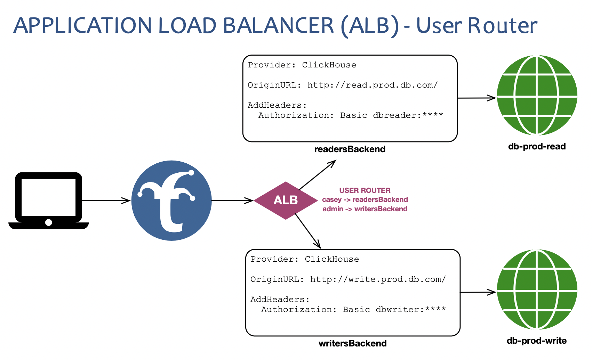

# Application Load Balancer

Trickster 2.0 provides an all-new Application Load Balancer that is easy to configure and provides unique features to aid with Scaling, High Availability and other applications. The ALB supports several balancing Mechanisms:

| Mechanism | Config | Provides | Description |
|-----|-----|-----|----|
| Round Robin | rr | Scaling | a basic, stateless round robin between healthy pool members |
| Time Series Merge | tsm | Federation | uses scatter/gather to collect and merge data from multiple replica tsdb sources |
| First Response | fr | Speed | fans a request out to multiple backends, and returns the first response received |
| First Good Response | fgr | Speed | fans a request out to multiple backends, and returns the first response received with a status code < 400 |
| Newest&nbsp;Last‑Modified | nlm | Freshness | fans a request out to multiple backends, and returns the response with the newest Last-Modified header |
| User Router | ur | Control | Inspects the credentials in the Request and routes it based on the Username |

## Integration with Backends

The ALB works by applying a Mechanism to select one or more Backends from a list of Healthy Pool Members, through which to route a request. Pool member names represent Backend Configs (known in Trickster 0.x and 1.x as Origin Configs) that can be pre-existing or newly defined.

All settings and functions configured for a Backend are applicable to traffic routed via an ALB - caching, rewriters, rules, tracing, TLS, etc.

In Trickster configuration files, each ALB itself is a Backend, just like the pool members to which it routes. This makes it possible to configure infinite loops (e.g., where ALB1 has ALB2 in its pool, and ALB2 has ALB1 in its pool). However, at startup Trickster will validate ALB configurations by following all ALBs' possible paths, and exit with a startup failure if any infinite loops are detected.

## Mechanisms Deep Dive

Each mechanism has its own use cases and pitfalls. Be sure to read about each one to understand how they might apply to your situation.

### Basic Round Robin

A basic **Round Robin** rotates through a pool of healthy backends used to service client requests. Each time a client request is made to Trickster, the round robiner will identify the next healthy backend in the rotation schedule and route the request to it.

The Trickster ALB is intended to support stateless workloads, and currently does not support Sticky Sessions or other advanced ALB capabilities.

#### Weighted Round Robin

Trickster supports Weighted Round Robin by permitting repeated pool member names in the same pool list. In this way, an operator can craft a desired apportionment based on the number of times a given backend appears in the pool list. We've provided an example in the snippet below.

Trickster's round robiner cycles through the pool in the order it is defined in the Configuration file. Thus, when using Weighted Round Robin, it is recommended to use a non-sorted, staggered ordering pattern in the pool list configuration, so as to prevent routing bursts of consecutive requests to the same backend.

#### More About Our Round Robin Mechanism

Trickster's Round Robin Mechanism works by maintaining an atomic uint64 counter that increments each time a request is received by the ALB. The ALB then performs a modulo operation on the request's counter value, with the denominator being the count of healthy backends in the pool. The resulting value, ranging from `0` to `len(healthy_pool) - 1` indicates the assigned backend based on the counter and current pool size.

#### Example Round Robin Configuration

```yaml
backends:

  # traditional Trickster backend configurations

  node01:
    provider: reverseproxycache # will cache responses to the default memory cache
    path_routing_disabled: true # disables frontend request routing via /node01 path
    origin_url: https://node01.example.com # make requests with TLS
    tls: # this backend might use mutual TLS Auth
      client_cert_path: ./cert.pem
      client_key_path: ./cert.key

  node02:
    provider: reverseproxy      # requests will be proxy-only with no caching
    path_routing_disabled: true # disables frontend request routing via /node02 path
    origin_url: http://node-02.example.com # make unsecured requests
    request_headers: # this backend might use basic auth headers
      Authoriziation: "basic jdoe:${NODE_02_AUTH_TOKEN}"

  # Trickster 2.0 ALB backend configuration, using above backends as pool members

  node-alb:
    provider: alb
    alb:
      mechanism: rr # round robin
      pool:
        - node01 # as named above
        - node02
        # - node02 # if this node were uncommented, weighting would change to 33/67
        # add backends multiple times to establish a weighting protocol.
        # when weighting, use a cycling list, rather than a sorted list.
```

Here is the visual representation of this configuration:


### Time Series Merge

The recommended application for using the **Time Series Merge** mechanism is as a High Availability solution. In this application, Trickster fans the client request out to multiple redundant tsdb endpoints and merges the responses back into a single document for the client. If any of the endpoints are down, or have gaps in their response (due to prior downtime), the Trickster cache along with the data from the healthy endpoints will ensure the client receives the most complete response possible. Instantaneous downtime of any Backend will result in a warning being injected in the client response.

Separate from an HA use case, it is possible to Time Series Merge as a Federation broker that merges responses from different, non-redundant tsdb endpoints; for example, to aggregate metrics from a solution running clusters in multiple regions, with separate, in-region-only tsdb deployments. In this use case, it is recommended to [inject labels](./prometheus.md#injecting-labels) into the responses to protect against data collisions across series. Label injection is demonstrated in the snippet below.

#### Providers Supporting Time Series Merge

Trickster currently supports Time Series Merging for the following TSDB Providers:

| Provider Name |
|---|
| Prometheus |

We hope to support more TSDB's in the future and welcome any help!

#### Example TS Merge Configuration

```yaml
backends:

  # prom01a and prom01b are redundant and poll the same targets
  prom01a:
    provider: prometheus
    origin_url: http://prom01a.example.com:9090
    prometheus:
      labels:
        region: us-east-1

  prom01b:
    provider: prometheus
    origin_url: http://prom01b.example.com:9090
      labels:
        region: us-east-1

  # prom-alb-01 scatter/gathers to prom01a and prom01b and merges responses for the caller
  prom-alb-01:
    provider: alb
    alb:
      mechanism: tsm # time series merge
      pool: 
        - prom01a
        - prom01b

  # prom02 and prom03 poll unique targets but produce the same metric names as prom01a/b
  prom02:
    provider: prometheus
    origin_url: http://prom02.example.com:9090
      labels:
        region: us-east-2

  prom03:
    provider: prometheus
    origin_url: http://prom03.example.com:9090
      labels:
        region: us-west-1

  # prom-alb-all scatter/gathers prom01a/b, prom02 and prom03 and merges their responses
  # for the caller. since a unique region label was applied to non-redundant backends,
  # collisions are avoided. each backend caches data independently of the aggregated response
  prom-alb-all:
    provider: alb
    alb:
      mechanism: tsm
      pool: 
        - prom01a
        - prom01b
        - prom02
        - prom03
```

Here is the visual representation of a basic TS Merge configuration:


### First Response

The **First Response** mechanism fans a request out to all healthy pool members, and returns the first response received back to the client. All other fanned out responses are cached (if applicable) but otherwise discarded. If one backend in the fanout has already cached the requested object, and the other backends do not, the cached response will return to the caller while the other backends in the fanout will cache their responses as well for subsequent requests through the ALB.

This mechanism works well when using Trickster as an HTTP object cache fronting multiple redundant origins, to ensure the fastest response possible is delivered to downstream clients - even if the HTTP Response Code indicates an error in the request or by the first backend to respond.

#### First Response Configuration Example

```yaml
backends:
  node01:
    provider: reverseproxycache
    origin_url: http://node01.example.com

  node02:
    provider: reverseproxycache
    origin_url: http://node-02.example.com

  node-alb-fr:
    provider: alb
    alb:
      mechanism: fr # first response
      pool:
        - node01
        - node02
```

Here is the visual representation of this configuration:


### First Good Response

The **First Good Response** (fgr) mechanism acts just as First Response does, except that it waits to return the first response with an HTTP Status Code < 400. If no fanned out response codes are in the acceptable range once all responses are returned (or the timeout has been reached), then the healthiest response, based on `min(all_responses_status_codes)`, is used.

This mechanism is useful in applications such as live internet television. Consider an operational condition where an object may have been written to Origin 1, but not yet written to redundant Origin 2, while users have already received references to and begin requesting the object in a separate manifest. Trickster, when used as an ALB+Cache in this scenario, will poll both backends for the object and cache the positive responses from Origin 1 for serving subsequent requests locally, while a negative cache configuration will avoid potential 404 storms on Origin 2 until the object can be written by the replication process.

#### Custom Good Status Codes List

By default, fgr will return the first response with a status code < 400. However, you can optionally provide an explicit list of good status codes using the `fgr_status_codes` configuration setting, as shown in the example below. When set, Trickster will return the first response to be returned that has a status code found in the configured list.

#### First Good Response Configuration Example

```yaml

negative-caches:
  default: # by default, backends use the 'default' negative cache
    "404": 500 # cache 404 responses for 500ms

backends:
  node01:
    provider: reverseproxycache
    origin_url: http://node-01.example.com

  node02:
    provider: reverseproxycache
    origin_url: http://node-02.example.com

  node-alb-fgr:
    provider: alb
    alb:
      mechanism: fgr # first good response
      fgr_status_codes: [ 200, 201, 204 ] # only consider these codes when selecting a response
      pool:
        - node01
        - node02
```

Here is the visual representation of this configuration:


### Newest Last-Modified

The **Newest Last-Modified** mechanism is focused on providing the user with the _newest_ representation of the response, rather than responding as quickly as possible. It will fan the client request out to all backends, and wait for all responses to come back (or the ALB timeout to be reached) before determining which response is returned to the user.

If at least one fanout response has a `Last-Modified` header, then any response not containing the header is discarded. The remaining responses are sorted based on their Last Modified header value, and the newest value determines which response is chosen.

This mechanism is useful in applications where an object residing at the same path on multiple origins is updated frequently, such as a DASH or HLS manifest for a live video broadcast. When using Trickster as an ALB+Cache in this scenario, it will poll both backends for the object, and ensure the newest version between them is used as the client response.

Note that with NLM, the response to the user is only as fast as the slowest backend to respond.

#### Newest Last-Modified Configuration Example

```yaml
backends:
  node01:
    provider: reverseproxycache
    origin_url: http://node01.example.com

  node02:
    provider: reverseproxycache
    origin_url: http://node-02.example.com

  node-alb-nlm:
    provider: alb
    alb:
      mechanism: nlm # newest last modified
      pool:
        - node01
        - node02
```

Here is the visual representation of this configuration:


### User Router

The User Router mechanism is used to control a Request's destination Backend based on the username in the request. A default Backend (for no-user and users not in the manifest) can be configured, as well as a Backend per-user.

When a User Router ALB is configured to use an [Authenticator](./authenticator.md), the ALB can also modify a Request's credentials before passing it off to the destination Backend. In the graphic below, user `casey` will be routed to the `readersBackend`, which proxies to a read-only database server with the `dbreader` credentials; while user `taylor` will be routed to the `writersBackend`, which proxies to a read-write database server with the `dbwriter` credentials. Here is the example configuration corresponding to the graphic:

```yaml
backends:
  readersBackend:
    provider: clickhouse
    origin_url: http://read.prod.db.com:8123/

  writersBackend:
    provider: clickhouse
    origin_url: http://write.prod.db.com:8123/

  click-lb-01:
    provider: alb
    authenticator_name: dbUsers
    alb:
      mechanism: ur # User Router Mechanism
      user_router: # User Router-specific configs
        default_backend: readersBackend # optional - users not in the list will route here, origin will 401
        users:
          casey:
            to_user: dbreader # replaces user casey with dbreader in the request's Authorization header
            to_credential: ${DB_READER_PW} # replaces credential in the Authorization header with this env
            # casey is sent to the default backend (readers) since to_backend is not set here
          taylor:
            to_user: dbwriter # replaces user taylor with dbwriter in the request's Authorization header
            to_credential: ${DB_WRITER_PW} # replaces credential in the Authorization header with this env
            to_backend: writersBackend # taylor is sent to the writers backend

authenticators:
  dbUsers:
    provider: clickhouse # use the clickhouse authenticator
    users_file: /path/to/user-manifest.csv # this file should include casey and taylor users
    users_file_format: csv # required when users_file is set
    users_format: bcrypt # passwords in the CSV are bcrypted
```



#### Supported Backend Provider Types

The User Router mechanism supports all Backend provider types for `default_backend` and `to_backend` values, including other User Router ALBs.

**However, config validation will fail if**:

* there are any possible infinite loops between backends configured
* users could ultimately be routed to different non-virtual (ALB/Rule) backend types by the same User Router ALB. The final ultimate route for all users must be of the same type (regardless of how many additional hops through ALBs and Rules the request would take).
  * In other words: user1 cannot be ultimately routed to a `clickhouse` backend and user2 be ultimately routed to a `prometheus` backend by the same User Router ALB.

#### User Router without an Authenticator

If a User Router ALB does not use an Authenticator, you can still configure user-specific Backend routes. In these cases Trickster will observe (but not authenticate) the username in the request and route based on the observed username. However, Trickster will exit with a validation failure on startup if a User Router ALB that does not utilize an Authenticator is configured to swap credentials. In short: users must be positively authenticated by a Trickster Authenticator for credential swapping to be permitted by the User Router ALB.

When a User Router ALB doesn't use an Authenticator, Trickster uses the final destination Backend provider type to select a default Authenticator (operating in observe-only mode / no users manifest) for username observation. For `clickhouse`-destined User Routers, the observe only Authenticator provider is `clickhouse`. For all other backend provider types, the default the observe only Authenticator provider is `basic` (Basic Auth).

#### to_user / to_credential vs Backend Path Header Injection

It is still possible to insert credentials to a Backend proxy request using the `request_headers` Backend Path config. But any `request_headers` alterations configured for auth-related headers (e.g., `Authorization`) are performed by the Backend after being handled by a User Router; so they would overwrite any user-specific `to_user` and `to_credential` transformations performed by the User Router ALB.

### Default Backend

As shown in the example config above, you can provide a `default_backend` config to a User Router, and users who are not in the user router list will be routed to this backend.

If you do not supply a `default_backend`, users who are not in the manifest will receive a default response of `502 Bad Gateway`. You can customize the default response code by setting `no_route_status_code` to a value between 400 and 599 as in this example:

```yaml
backends:
  prod-01:
    provider: reverseproxy
    origin_url: https://example.com/

  users-lb-01:
    provider: alb
    alb:
      mechanism: ur
      authenticator_name: all-users # not shown for brevity, see above examples
      user_router:
        no_route_status_code: 401 # unauthorized response for users not in allow list
        users: # allowed users
          casey:
            to_backend: prod-01
          taylor:
            to_backend: prod-01
          kris:
            to_backend: prod-01
```

### User Router ALB Backend Pool and Health Checking

The User Router does not rotate through or fanout to a Pool of Backends like the other ALB mechanisms. It also does not consider whether a destination backend is considered healthy or not. Users are blindly routed their configured (or default) backends regardless of health status.

You can configure a User Router ALB's backend destinations to be other ALBs with mechanisms that utilize healthchecked pools.

## Maintaining Healthy Pools With Automated Health Check Integrations

Health Checks are configured per-Backend as described in the [Health documentation](./health.md). Each Backend's health checker will notify all ALB pools of which it is a member when its health status changes, so long as it has been configured with a [health check interval](./health#example+health+check+configuration+for+use+in+alb) for automated checking. When an ALB is notified that the state of a pool member has changed, the ALB will reconstruct its list of healthy pool members before serving the next request.

## Health Check States

A backend will report one of three possible health states to its ALBs: `unavailable (-1)`, `unknown (0)`, or `available (1)`.

### Health-Based Backend Selection

Each ALB has a configurable `healthy_floor` value, which is the threshold for determining which pool members are included in the healthy pool, based on their instantaneous health state. The `healthy_floor` represents the minimum acceptable health state value for inclusion in the healthy pool. The default `healthy_floor` value is `0`, meaning Backends in a state `>= 0` (`unknown` and `available`) are included in the healthy pool. Setting `healthy_floor: 1` would include only `available` Backends, while a value of `-1` will include all backends in the configured pool, including those marked as `unavailable`.

Backends that do not have a [health check interval](./health#example+health+check+configuration+for+use+in+alb) configured will remain in a permanent state of `unknown`. Backends will also be in an `unknown` state from the time Trickster starts until the first of any configured automated health check is completed. Note that if an ALB is configured with `healthy_floor: 1`, any pool members that are not configured with an automated health check interval will never be included in the ALB's healthy pool, as their state is permanently `0`.

### Example ALB Configuration Routing Only To Known Healthy Backends

```yaml
backends:
  prom01:
    provider: prometheus
    origin_url: http://prom01.example.com:9090
    healthcheck:
      interval: 1000ms # enables automatic health check polling for ALB pool reporting

  prom02:
    provider: prometheus
    origin_url: http://prom02.example.com:9090
    healthcheck:
      interval: 1000ms

  prom-alb-tsm:
    provider: alb
    alb:
      mechanism: tsm   # times series merge healthy pool members
      healthy_floor: 1 # only include Backends reporting as 'available' in the healthy pool
      pool:
        - prom01
        - prom02
```

## All-Backends Health Status Page

Trickster 2.0 provides a new global health status page available at `http://trickster:metrics-port/trickster/health` or (the configured `health_handler_path`).

The global status page will display the health state about all backends configured for automated health checking. Here is an example configuration and a possible corresponding status page output:

```yaml
backends:
  proxy-01:
    provider: reverseproxy
    origin_url: http://server01.example.com
    # not configured for automated health check polling

  prom-01:
    provider: prometheus
    origin_url: http://prom01.example.com:9090
    healthcheck:
      interval: 1000ms # enables automatic health check polling every 1s

  flux-01:
    provider: inflxudb
    origin_url: http://flux01.example.com:8086
    healthcheck:
      interval: 1000ms # enables automatic health check polling every 1s
```

```text
$ curl "http://${trickster-fqdn}:8481/trickster/health"

Trickster Backend Health Status            last change: 2020-01-01 00:00:00 UTC
-------------------------------------------------------------------------------

prom-01      prometheus   available

flux-01      influxdb     unavailable since 2020-01-01 00:00:00 UTC
                                    
proxy-01     proxy        not configured for automated health checks

-------------------------------------------------------------------------------
You can also provide a 'Accept: application/json' Header or query param ?json
```

### JSON Health Status

As the table footer from the plaintext version of the health status page indicates, you may also request a JSON version of the health status for machine consumption. The JSON version includes additional detail about any Backends marked as `unavailable`, and is structured as follows:

```bash
$ curl "http://${trickster-fqdn}:8481/trickster/health?json" | jq

{
  "title": "Trickster Backend Health Status",
  "udpateTime": "2020-01-01 00:00:00 UTC",
  "available": [
    {
      "name": "flux-01",
      "provider": "influxdb"
    }
  ],
  "unavailable": [
    {
      "name": "prom-01",
      "provider": "prometheus",
      "downSince": "2020-01-01 00:00:00 UTC",
      "detail": "error probing target: dial tcp prometheus:9090: connect: connection refused"
    }
  ],
  "unchecked": [
    {
      "name": "proxy-01",
      "provider": "proxy"
    }
  ]
}
```
