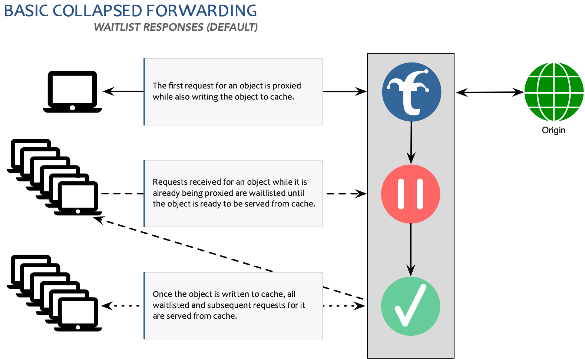
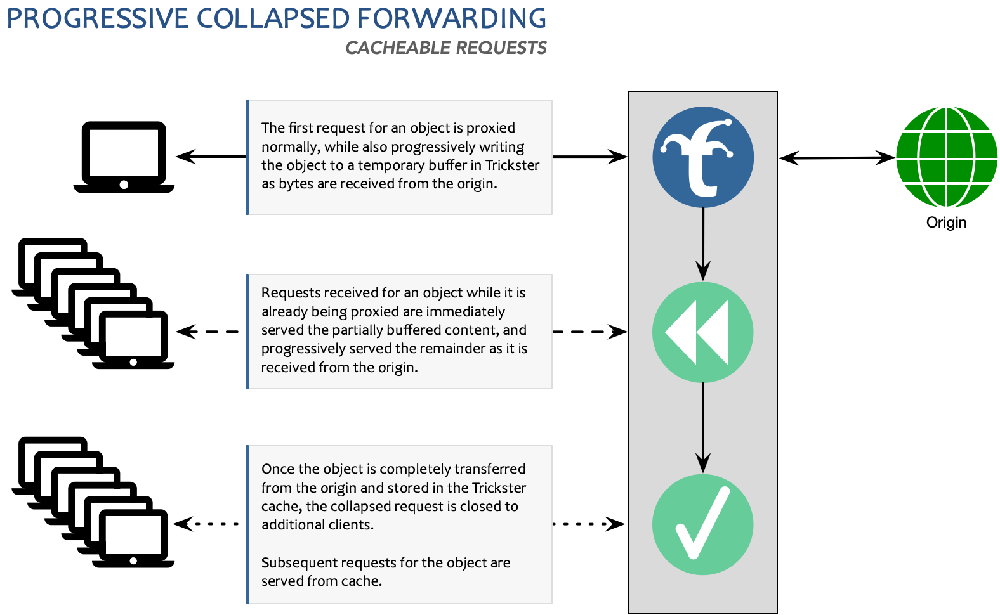
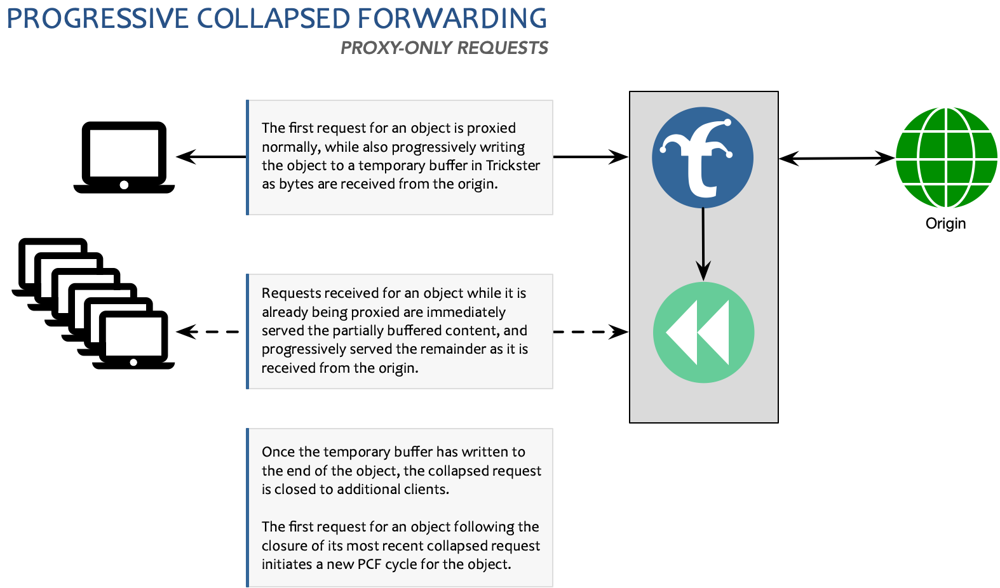

# Collapsed Forwarding

Collapsed Forwarding is feature common among Reverse Proxy Cache solutions like Squid, Varnish and Apache Traffic Server. It works by ensuring only a single request to the upstream origin is performed for any object on a cache miss or revalidation attempt, no matter how many users are requesting the object at the same time.

Trickster has support for two types of Collapsed Forwarding: Basic (default) and Progressive

## Basic Collapsed Forwarding

Basic Collapsed Forwarding is the default functionality for Trickster, and works by waitlisting all requests for a cacheable object while a cache miss is being serviced for the object, and then serving the waitlisted requests once the cache has been populated.

The feature is further detailed in the following diagram:



## Progressive Collapsed Forwarding

Progressive Collapsed Forwarding (PCF) is an improvement upon the basic version, in that it eliminates the waitlist and serves all simultaneous requests concurrently while the object is still downloading from the server, similar to Apache Traffic Server's "read-while-write" feature. This may be useful in low-latency applications such as DASH or HLS video delivery, since PCF minimizes Time to First Byte latency for extremely popular objects.

The feature is further detailed in the following diagram:



### PCF for Proxy-Only Requests

Trickster provides a unique feature that implements PCF in Proxy-Only configurations, to bring the benefits of Collapsed Forwarding to HTTP Paths that are not configured to be routed through the Reverse Proxy Cache. (See [Paths](./paths.md) documentation for more info on routing).

The feature is further detailed in the following diagram:



## How to enable Progressive Collapsed Forwarding

When configuring path configs as described in [Paths Documentation](./paths.md) you simply need to add `progressive_collapsed_forwarding = true` in any path config using the `proxy` or `proxycache` handlers.

Example:

```yaml
origins:
  test:
    paths:
      thing1:
        path: /test_path1/
        match_type: prefix
        handler: proxycache
        progressive_collapsed_forwarding: true
      thing2:
        path: /test_path2/
        match_type: prefix
        handler: proxy
        progressive_collapsed_forwarding: true
```

See the [example.full.yaml](../examples/conf/example.full.yaml) for more configuration examples.

## How to test Progressive Collapsed Forwarding

An easy way to test PCF is to set up your favorite file server to host a large file(Lighttpd, Nginx, Apache WS, etc.), In Trickster turn on PCF for that path config and try make simultaneous requests.
If the networking between your machine and Trickster has enough bandwidth you should see both streaming at the equivalent rate as the origin request.

Example:

- Run a Lighttpd instance or docker container on your local machine and make a large file available to be served
- Run Trickster locally
- Make multiple curl requests of the same object

You should see the speed limited on the origin request by your disk IO, and your speed between Trickster limited by Memory/CPU
