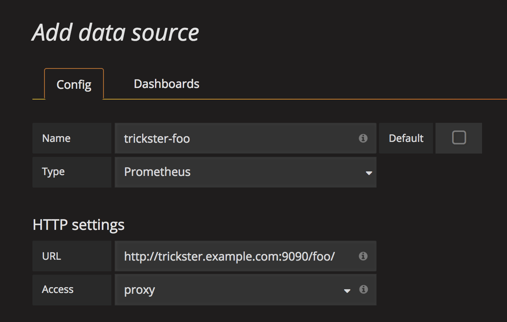

# Using Multiple Backends with a single Trickster instance

Trickster supports proxying to multiple backends in a single Trickster instance, by examining the inbound request and using a multiplexer to direct the proxied request to the correct upstream origin, in the same way that web servers support virtual hosting.

There are 2 ways to route to multiple backends.

* HTTP Pathing
* DNS Aliasing

## Basic Usage

To utilize multiple backends, you must craft a Trickster configuration file to be read when Trickster starts up - operating with environment variables or command line arguments only supports accelerating a single backend. The [example.full.yaml](../examples/conf/example.full.yaml) provides good documentation and commented sections demonstrating multiple backends. The config file should be placed in `/etc/trickster/trickster.yaml` unless you specify a different path when starting Trickster with the `-config` command line argument.

Each backend that your Trickster instance supports must be explicitly enumerated in the configuration file. Trickster does not support open proxying.

Example backend configuration:

```yaml
backends:
  my-backend-01: # routed via http://trickster:8480/my-backend-01/
    provider: prometheus
    origin_url: http://my-origin-01.example.com

  my-backend-02: # routed via http://trickster:8480/my-backend-02/
    hosts: [ my-fqdn-02.example.com ] # or http://my-fqdn-02.example.com:8480/
    provider: prometheus
    origin_url: http://my-origin-02.example.com

  my-backend-03:
    path_routing_disabled: true # only routable via Host header, an ALB, or a Rule
    hosts: [ my-fqdn-03.example.com ] # or http://my-fqdn-03.example.com:8480/
    provider: prometheus
    origin_url: http://my-origin-02.example.com
```

### Default Backend

Whether proxying to one or more upstreams, Trickster has the concept of a "default" backend, which means it does not require a specific DNS hostname in the request, or a specific URL path, in order to proxy the request to a known backend. When a default backend is configured, if the inbound request does not match any mapped backends by path or FQDN, the request will automatically be routed through the default backend. You are probably familiar with this behavior from when you first tried out Trickster with the using command line arguments.

Here's an example: if you have Trickster configured with an backend named `foo` that proxies to `http://foo/` and is configured as the default backend, then requesting `http://trickster/image.jpg` will initiate a proxy request to `http://foo/image.jpg`, without requiring the path be prefixed with `/foo`. But requesting to `http://trickster/foo/image.jpg` would also work.

The default backend can be configured by setting `is_default: true` for the backend you have elected to make the default.  Having a default backend is optional. In a single-backend configuration, Trickster will automatically set the sole backend as `is_default: true` unless you explicitly set `is_default: false` in the configuration file. If you have multiple backends, and don't wish to have a default backend, you can just omit the value for all backends. If you set `is_default: true` for more than one backend, Trickster will exit with a fatal error on startup.

### Path-based Routing Configurations

In this mode, Trickster will use a single FQDN but still map to multiple upstream backends by path. This is the simplest setup and requires the least amount of work. The client will indicate which backend is desired in URL Path for the request.

Example Path-based Configuration with Multiple Backends:

```yaml
backends:
  # backend1 backend
  backend1:
    origin_url: 'http://prometheus.example.com:9090'
    provider: prometheus
    cache_name: default
    is_default: true
  # "foo" backend
  foo:
    origin_url: 'http://influxdb-foo.example.com:9090'
    provider: influxdb
    cache_name: default
  # "bar" backend
  bar:
    origin_url: 'http://prometheus-bar.example.com:9090'
    provider: prometheus
    cache_name: default
```

#### Using HTTP Path as the Backend Routing Indicator

The client prefixes the Trickster request path with the Backend Name.

This is the recommended method for integrating with applications like Grafana.

Example Client Request URLs:

* To Request from Origin `foo`: <http://trickster.example.com:8480/foo/query?query=xxx>

* To Request from Origin `bar`: <http://trickster.example.com:8480/bar/query?query=xxx>

* To Request from Origin `backend1` as default: <http://trickster.example.com:8480/query?query=xxx>

* To Request from Origin `backend1` (Method 2, with Origin Name): <http://trickster.example.com:8480/backend1/query?query=xxx>

* Configuring Grafana to request from backend `foo` via Trickster:



### DNS Alias Configuration

In this mode, multiple DNS records point to a single Trickster instance. The FQDN used by the client to reach Trickster is mapped to specific backend configurations using the `hosts` list. In this mode, the URL Path is _not_ considered during Backend Selection.

Example DNS-based Backend Configuration:

```yaml
backends:
  # backend1 backend
  backend1:
    hosts: # users can route to this backend via these FQDNs, or via `/backend1`
      - 1.example.com
      - 2.example.com
    origin_url: 'http://prometheus.example.com:9090'
    provider: prometheus
    cache_name: default
    is_default: true
  # "foo" backend
  foo:
    hosts: # users can route to this backend via these FQDNs, or via `/foo`
      - trickster-foo.example.com
    origin_url: 'http://prometheus-foo.example.com:9090'
    provider: prometheus
    cache_name: default
  # "bar" backend
  bar:
    hosts: # users can route to this backend via these FQDNs, or via `/bar`
      - trickster-bar.example.com
    origin_url: 'http://prometheus-bar.example.com:9090'
    provider: prometheus
    cache_name: default
```

Example Client Request URLs:

* To Request from Origin `foo`: <http://trickster-foo.example.com:8480/query?query=xxx>

* To Request from Origin `bar`: <http://trickster-bar.example.com:8480/query?query=xxx>

* To Request from Origin `backend1` as default: <http://trickster.example.com:8480/query?query=xxx>

* To Request from Origin `backend1` (Method 2, via FQDN): <http://backend1.example.com:8480/query?query=xxx>

Note: It is currently possible to specify the same FQDN in multiple backend configurations. You should not do this (obviously). A future enhancement will cause Trickster to exit fatally upon detection at startup.

## Disabling Path-based Routing for a Backend

You may wish for a backend to be inaccessible via the `/backend_name/` path, and only by Hostname or as the target of a [rule](./rule.md) or [ALB](./alb.md). You can disable path routing by setting `path_routing_disabled: true` for the backend, as in this example, which requires the Request's Host header match `1.example.com` or `2.example.com` in order to be routed to the backend:

```yaml
backends:
  backend1:
    hosts:
      - 1.example.com
      - 2.example.com
    origin_url: 'http://prometheus.example.com:9090'
    provider: prometheus
    cache_name: default
    is_default: false
    path_routing_disabled: true # this will disable routing through /backend1
```
