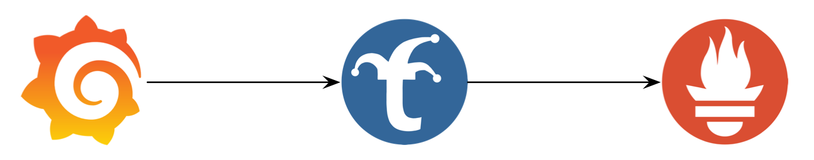
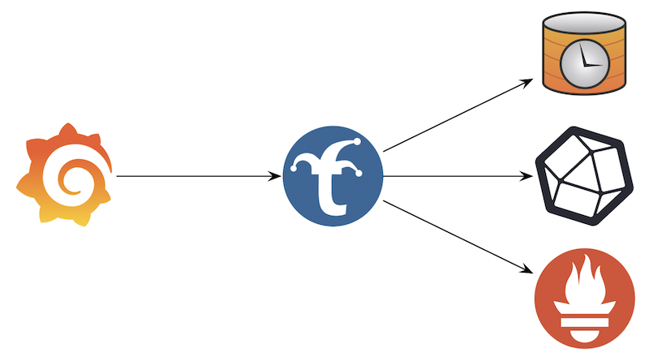
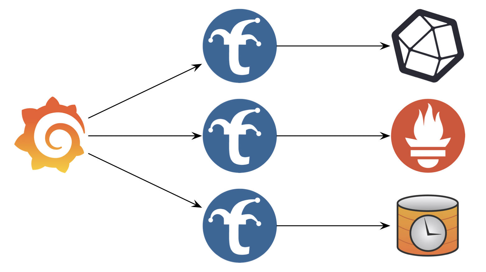

# Where to Place Trickster

Depending upon the size of your existing or planned deployment, there are several placement configurations available. These designs are suggestions based on common usage, and you may find alternative or hybrid placement configurations that make the most sense for your situation, based on the activity of your Dashboard and Prometheus instance(s).

## Single "Everything"

Single "Everything" is the most common placement model. In this configuration, you have one dashboard endpoint, one Trickster endpoint and one Prometheus endpoint. Behind each endpoint, you may have a single instance or a cluster. Each component is only aware of the other component's endpoint exposure and not the underlying configuration. This configuration represents a one-for-one-for-one deployment of your Dashboard, Prometheus, and Trickster endpoints.

## Multi-Origin

In a Multi-Origin placement, you have one dashboard endpoint, one Trickster endpoint, and multiple Prometheus endpoints. Trickster is aware of each Prometheus endpoint and treats them as unique databases to which it proxies and caches data independently of each other.

This is a good configuration to use when you have a single dashboard that displays data about multiple redundant clusters (each with its own Prometheus), or when you have a single dashboard representing information about many different kinds of systems. For example, if you operate a "Dashboard as a Service" solution under which many teams use your Dashboard system by designing their own dashboard screens and bringing their own databases, a single Trickster endpoint can be used to accelerate dashboards for all of your customers.

You will need to configure each Trickster-to-Prometheus mapping separately in your dashboard application as a separately named Prometheus data source. Refer to the [multi-origin](./multi-origin.md) documentation for configuring multi-origin support in Trickster and Grafana.

In this configuration, be aware that the default 'memory' cache may be underpowered depending on the number of customers, as well as the size and number of queries that need to be cached by each customer. Refer to the [caches](./caches.md) document to select and configure the caching layers as needed to meet your specific situation.

## Multi-Trickster

In a Multi-Trickster configuration, you have one dashboard endpoint, multiple Trickster endpoints, and multiple Prometheus endpoints, with each Trickster Endpoint having a one-to-one mapping to a Prometheus Endpoint as a pair. This is a good design if Multi-Origin is not performant enough for the amount of activity associated with your solution (e.g., you need more Tricksters). If the Dashboard system owner is different from the Prometheus system owner, either party could own and operate the Trickster instance.
