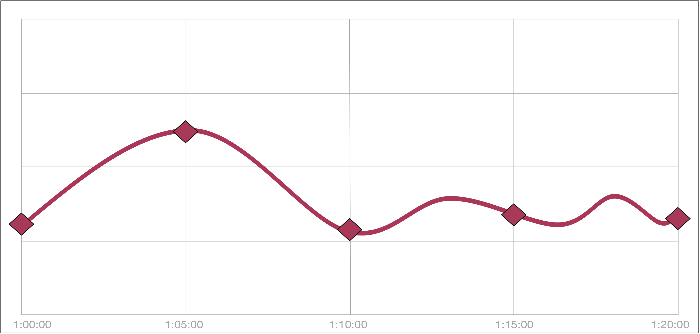

# Step Alignment

Dashboards ask for ranges like "the last 6 hours", so the start and end of every
request are a few seconds later than the last one. Time series databases group
data into steps, or buckets, on a fixed grid, and a range that starts or ends
between two grid points leaves a *partial bucket* at that edge: a bucket that
holds only some of the rows in its span.

Step alignment is what Trickster does with those partial buckets. Other tools
call the same idea "aligning queries with their step" (Thanos, Mimir, Cortex and
Loki) or "dropping partial buckets" (Kibana). In those tools it is an on/off
switch; Trickster offers several modes, chosen per backend and, when needed,
per query.



## Why It Matters

Trickster's time series cache holds complete buckets only. A partial bucket's
value depends on exactly where the client's range started or ended, so caching
it as if it were complete would serve wrong values to the next dashboard that
asks for that bucket. However a mode treats partial buckets, it never writes one
to the time series cache. Complete buckets are what make repeat and overlapping
requests fast.

## Modes

| Mode | Start edge | End edge | What the client sees |
|---|---|---|---|
| `truncate` | the whole bucket that contains the start | left out | points on the grid from the bucket containing the start; the first includes rows before the start |
| `drop` | left out | left out | complete buckets only, all of them inside the requested range |
| `partial` | the rows from the start to the next grid point | the rows from the last grid point to the end | what the origin would answer for the range: complete buckets plus both partial ones |
| `partial_start` | as `partial` | as `truncate` | the origin's first bucket, and no partial bucket at the end |
| `partial_end` | as `truncate` | as `partial` | a live right edge, with the start snapped to the grid |
| `off` | not applied | not applied | the origin's own answer to the range as sent, cached as an object for one minute |

- A range whose start and end are on the grid gets the same answer in every mode.
- `truncate` and `drop` differ only at the start: at the end both stop before the
  bucket the end falls in.
- **The live bucket**, the one that contains the current time, is always
  partial. It appears only in `partial` and `partial_end`, whose end edge is
  partial. Under `truncate`, `drop` and `partial_start` a range that runs to now,
  or has no end at all, stops before it.
- **A range with no complete bucket**, one shorter than a step or one that
  crosses a single grid point, is sent to the origin unchanged in every mode.
  The origin's answer is cached as an object for `partial_bucket_ttl`, keyed on
  the range as sent.
- `off` sends each request to the origin with the range the client sent, and
  caches the response as an object for one minute under a key that includes
  that range. Identical requests share it, but dashboards with relative ranges
  rarely send the same range twice. Use it when a client needs the origin's
  exact output, such as a conformance test, and the time series cache can't
  provide it.

### Example

With a one-minute step and a client range of 10:00:30 to 10:05:20:

| Mode | Buckets in the response |
|---|---|
| `truncate` | 10:00 (whole) through 10:04 |
| `drop` | 10:01 through 10:04 |
| `partial` | 10:00 (rows from 10:00:30), 10:01 through 10:04, 10:05 (rows up to 10:05:20) |
| `partial_start` | 10:00 (rows from 10:00:30), 10:01 through 10:04 |
| `partial_end` | 10:00 (whole), 10:01 through 10:04, 10:05 (rows up to 10:05:20) |

In every mode, only the buckets 10:01 through 10:04 come from, and go into, the
time series cache. The whole 10:00 bucket that `truncate` returns is complete,
and is cached too.

## How Partial Buckets Are Fetched

In the `partial` modes, each partial bucket is its own small query to the
origin, bounded by the client's range and sent through the object cache:

- It is cached for `partial_bucket_ttl` (15 seconds unless configured, and never
  more than `max_ttl`), keyed on its exact range. A partial bucket is short-lived:
  the next refresh usually asks for a different one.
- Its rows are merged into the response after the cached complete buckets. They
  are never written to the time series cache.
- A partial end bucket never runs past the client's end. When the end is written
  as `now()` or left open, the query is sent that way, so every request within
  the same bucket shares one object; an end written as a timestamp, as Grafana
  sends it, makes a new object on each refresh.
- A partial bucket that fails is left out of the response, and reported as
  `err`.
- A fetch doesn't change the request's cache status (`hit`, `phit` and so on).
  Each is reported in the `partial_buckets` field of the
  [`X-Trickster-Result` header](./trickster-result.md).

### Cost

The `partial` modes trade origin requests for fidelity at the edges. With a
Grafana dashboard refreshing a relative range, where both edges move on each
refresh:

| Refresh | `truncate` or `drop` | `partial_end` | `partial` |
|---|---|---|---|
| every complete bucket cached | 0 | 1 | 2 |
| a new bucket has closed since the last refresh | 1 | 2 | 3 |
| nothing cached for the query | 1 | 2 | 3 |

Counts are origin requests; a partial bucket that is still in the object cache
costs none. Each partial bucket query scans at most one bucket of raw rows,
though with a high-cardinality `GROUP BY` it still returns one row per series.
The defaults keep today's behavior, so the extra requests are opt-in.

## Prometheus And Fast Forward

A Prometheus range query evaluates at points rather than aggregating buckets,
so it has no partial start bucket. Its modes are:

- `truncate`: points from the grid point at or before the start.
- `drop`: points from the grid point at or after the start, so every point lies
  inside the range.
- `partial_end`, the default: `truncate`, plus the live point at the current
  time when the range reaches it. This is Trickster's [Fast Forward](../README.md#3-fast-forward),
  and is reported as `ffstatus`. It is skipped when the step is no longer than
  `partial_bucket_ttl`.
- `off`.

`partial` and `partial_start` aren't supported. `fast_forward_disable: true`
selects `truncate` as the default, and a backend can't set both it and
`step_alignment`. The `trickster-fast-forward:off` directive still turns Fast
Forward off for one query.

## Configuration

`step_alignment` is a backend option; when it is unset, the provider's default
applies:

```yaml
backends:
  ch1:
    provider: clickhouse
    origin_url: http://clickhouse:8123
    # truncate | drop | partial | partial_start | partial_end | off
    step_alignment: partial_end
    # how long a partial bucket is kept in the object cache
    partial_bucket_ttl: 15s
```

- A mode the provider doesn't support fails the configuration when it loads.
- Setting `off` on a `proxy_only` backend logs a warning, because the backend
  caches nothing anyway.
- `volatile_window` and `volatile_window_points` work the same in every mode:
  they apply to complete buckets, the only ones the time series cache holds.
- The object cache entries of `off`, of ranges with no complete bucket, and of
  partial buckets are stored for requests that carry credentials, keyed on
  those credentials, as the time series cache stores them.

### Per Query

A query can choose its own mode with the `trickster-step-align` directive, written
in a comment in the query's own language:

```promql
sum(rate(http_requests_total[5m])) # trickster-step-align:drop
```

```sql
SELECT ... /* trickster-step-align:partial_end */
```

The directive always overrides the backend's mode. When the query's language or
shape doesn't support the mode it names, the query runs in its default mode and
the fallback is counted in `trickster_step_alignment_fallbacks_total`. See
[Per-Query Instructions](./per-query-instructions.md) for each language's
comment syntax.

### Load Balancers

On an [ALB](./alb.md), `step_alignment` applies one mode to every pool member,
whatever the mechanism, so that members answer on one grid; for requests
through the ALB, it replaces each member's own mode. Without it, only a `tsm`
ALB applies a mode.

- A `tsm` ALB without its own `step_alignment` applies its first configured
  member's mode, so merged series line up. A leader outage doesn't change it,
  because the first *configured* member is used, not the first healthy one.
- For a static pool, a member that can't apply the ALB's mode fails the
  configuration and is named in the error. When autodiscovered members can't,
  the pool falls back to `truncate` if they all support it, and otherwise each
  member uses its own mode; either way a warning is logged and added to merged
  responses.
- A query's `trickster-step-align` directive wins over the ALB's mode when every
  member supports the mode it names.
- At startup, Trickster warns about each ALB whose members would apply
  different modes.

## Support by Backend

| Backend and query path | Supported modes | Default |
|---|---|---|
| Prometheus range queries | `truncate`, `drop`, `partial_end`, `off` | `partial_end` (`truncate` with `fast_forward_disable`) |
| Graphite render | `truncate`, `off` | `truncate` |
| InfluxDB InfluxQL (1.x and 3.x) | all | `partial_end` |
| InfluxDB Flux | `truncate`, `off` | `truncate` |
| InfluxDB SQL, over HTTP and Flight SQL | all | `drop` |
| InfluxDB Prometheus remote read | `truncate` | `truncate` |
| ClickHouse, over HTTP and the native protocol | all | `drop` |
| Druid native queries | all | `partial` |
| Druid SQL | all | `drop` |
| PostgreSQL and TimescaleDB | all | `drop` |
| MySQL | all | `drop` |
| GreptimeDB PromQL | `truncate`, `drop`, `partial_end`, `off` | `partial_end` |
| GreptimeDB SQL, over HTTP, MySQL and PostgreSQL | all | `drop` |

A backend accepts any mode one of its paths supports; a query on a path that
doesn't support the configured mode runs in that path's default. Graphite has no
partial buckets: whisper stores whole buckets and returns only those. Flux
labels windows by their stop time, so its partial buckets would land on
different labels; it supports `truncate` and `off` for now. Remote read returns
raw samples, which have no grid.

## Observability

| Signal | What it reports |
|---|---|
| `partial_buckets` in [`X-Trickster-Result`](./trickster-result.md) | each partial bucket's fetched range, edge and object cache status |
| `trickster_proxy_partial_bucket_fetches_total{backend_name, provider, edge, status}` | partial bucket fetches, by edge (`start` or `end`) and status |
| `trickster_step_alignment_fallbacks_total{backend_name, requested, applied}` | requests for a mode the query doesn't support, served in its default mode |
| span attribute `step_alignment.mode` | the mode a request was served in |

## Troubleshooting

- **The first and last points are missing.** The backend's mode is `drop`, the
  SQL default. `partial` returns what the origin would; `truncate` returns a
  whole first bucket.
- **The first point includes data from before the range.** The mode is
  `truncate` or `partial_end`, which return the whole bucket at the start.
  `partial` or `partial_start` return only the rows inside the range.
- **Partial bucket fetches miss on every refresh.** The query's end is a
  timestamp, as Grafana writes it, so each refresh asks for a different partial
  bucket. That is expected: each is one small query. Ends written as `now()`
  share one object per bucket.
- **`trickster_step_alignment_fallbacks_total` is rising.** Queries, or a
  directive, are asking for a mode their path doesn't support. The `requested`
  and `applied` labels name both.
- **A merged ALB response carries a warning about step alignment.** Some
  autodiscovered pool members can't apply the ALB's mode; see
  [Load Balancers](#load-balancers).
