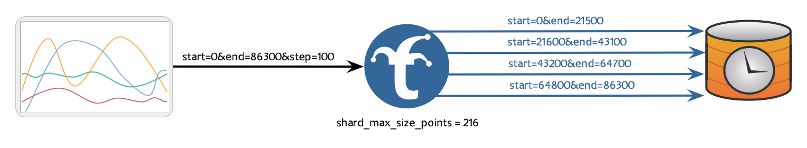
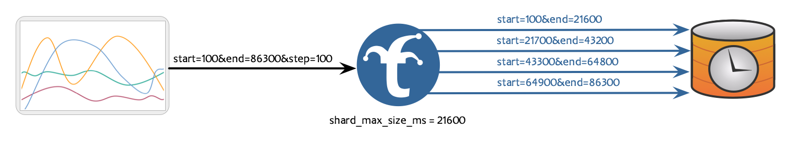
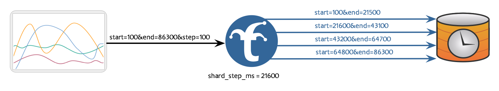
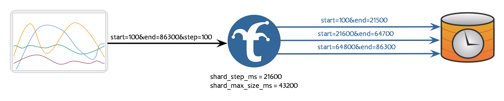

# Timeseries Request Sharding

## Overview

A shard means "a small part of a whole," and Trickster 2.0 supports the sharding of upstream HTTP requests when retrieving timeseries data. When configured for a given time series backend, Trickster will shard eligible requests by inspecting the time ranges needed from origin and subdividing them into smaller ranges that conform to the backend's sharding configuration. Sharded requests are sent to the origin concurrently, and their responses are reconstituted back into a single dataset by Trickster after they've all been returned.

## Mechanisms

Trickster support three main mechanisms for sharding:

----

 - Maximum Timestamps Per Shard - Trickster calculates number of expected unique timestamps in the response by dividing the requested time range size by the step cadence, and then subdivides the time ranges so that each sharded request's time range will return no more timestamps than the configured maximum.



 - Maximum Time Range Width Per Shard - Trickster inspects each needed time range, and subdivides them such that each sharded request's time range duration is no larger than the configured maximum.



 - Epoch-Aligned Maximum Time Range Width Per Shard - Trickster inspects each needed time range, and subdivides them such that each sharded request's time range duration is no larger than the configured maximum, while also ensuring that each shard's time boundaries are aligned to the Epoch based on the configured shard step size.





## Configuring

### Maximum Unique Timestamp Count Per Shard

In the Trickster configuration, use the `shard_max_size_points` configuration to shard requests by limiting the maximum number of unique timestamps in each sharded response.

```yaml
backends:
  example:
    provider: prometheus
    origin_url: http://prometheus:9090
    shard_max_size_points: 10999
```

### Maximum Time Range Width Per Shard

In the Trickster configuration, use the `shard_max_size_time` configuration to shard requests by limiting the maximum width of each sharded request's time range.

```yaml
backends:
  example:
    provider: 'prometheus'
    origin_url: http://prometheus:9090
    shard_max_size_time: 2h
```

### Epoch-Aligned Maximum Time Range Width Per Shard

In the Trickster configuration, use the `shard_step` configuration to shard requests by limiting the maximum width of each sharded request's time range, while ensuring shards align with the epoch on the configured cadence. This is useful for aligning shard boundaries with an upstream database's partition boundaries, ensuring that sharded requests have as little partition overlap as possible.

```yaml
backends:
  example:
    provider: 'prometheus'
    origin_url: http://prometheus:9090
    shard_step: 2h
```

`shard_step` can be used in conjunction with `shard_max_size_time`, so long as `shard_max_size_time` is perfectly divisible by `shard_step`. This combination configuration will align shards against the configured shard step, while sizing each shard's time range to be multiple shard steps wide.

```yaml
backends:
  example:
    provider: 'prometheus'
    origin_url: http://prometheus:9090
    shard_step: 2h
    shard_max_size_time: 4h
```

Neither `shard_step` or `shard_max_size_time` can be used in conjunction with `shard_max_size_points`.
